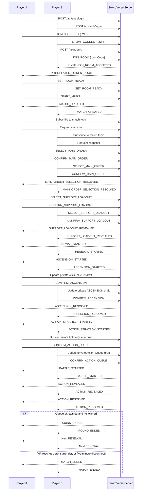

# SwordVerse API and WebSocket Contract

## Purpose and scope

This document defines the server-authoritative contract for SwordVerse 1.0, an online 1v1 round-based auto-combat game described in [README.md](README.md). It covers the React + TypeScript client (Redux Toolkit, RTK Query, React Router, STOMP.js) and the Spring Boot server (REST, STOMP over WebSocket, JWT).

Only two players can participate in a room or a match. The contract covers authentication, private rooms, pre-match Order selection, round progression, auto-combat, reconnects, and match results. Matchmaking, ranking, spectators, chat, replay, guilds, shops, and other features are intentionally excluded.

The server is authoritative. Clients submit player intent and render the returned state. Clients must not calculate or submit official damage, HP, STR, DEF, AS, MP, QP, effects, Action execution order, phase changes, or match results.

## Game rules represented by the contract

### Orders, Techniques, and Actions

Each player first secretly selects one **Main Order**. Once both confirm, the server reveals both Main Orders. Each player then secretly selects one **Support Order** and exactly one **Support Technique** belonging to that Support Order. Once both confirm, the server reveals both support loadouts and builds each player's available Action list:

```text
Basic Actions + 3 Main Techniques + 1 Support Technique
```

An Order supplies stats and Techniques. The public player state uses the README stat set:

| Stat | Meaning |
| --- | --- |
| `STR` | Damage potential |
| `HP` | Life; reaching zero loses the match |
| `DEF` | Damage reduction |
| `AS` | Attack speed used by server execution rules |
| `MP` | Resource used by Actions |
| `QP` | Resource used by selected Actions |

The server owns all formulas and the exact rules by which stats, costs, effects, and Action order are resolved.

### Match flow

```text
Login → WebSocket connect → Host or join room → both ready → match created
→ Main Order selection → Support Order/Technique selection
→ RENEWAL → ASCENSION → ACTION_STRATEGY → BATTLE
→ RENEWAL (next round) or GAME_OVER
```

Each round has the four README phases:

1. `RENEWAL`: server resolves active effects, converts remaining MP to QP at the Order-defined ratio, then fully restores MP.
2. `ASCENSION`: each player privately allocates 2 Learning Points (LP) to stats, learning a Technique, or levelling an existing Technique. Both allocations resolve simultaneously.
3. `ACTION_STRATEGY`: each player privately configures and confirms an Action Queue.
4. `BATTLE`: the server reveals and resolves Actions one at a time and emits the Battle Log.

Action Queue length by round:

| Round | Required queue size |
| ---: | ---: |
| 1 | 2 |
| 2 | 3 |
| 3 | 4 |
| 4 | 5 |
| 5 | 6 |
| 6+ | 7 |

After round 1, a plan may remove at most one occurrence from the previous queue. The retained occurrences must keep their relative order; newly available Actions can be inserted at the beginning, end, or between retained occurrences.

The match ends immediately when HP reaches zero, a player surrenders, or a player has stayed disconnected for more than five minutes. Result reasons are `HP_REACHED_ZERO`, `SURRENDER`, and `DISCONNECTED`.

## Authentication and transport

### REST authentication

Protected REST calls send:

```http
Authorization: Bearer <access-token>
Content-Type: application/json
```

The server issues a short-lived JWT access token and a refresh token. All production traffic uses HTTPS.

| Method | Path | Authentication | Request body | Success response | Errors |
| --- | --- | --- | --- | --- | --- |
| `POST` | `/api/auth/register` | None | `username`, `password` | `201` session | `VALIDATION_ERROR` |
| `POST` | `/api/auth/login` | None | `username`, `password` | `200` session | `UNAUTHORIZED`, `VALIDATION_ERROR` |
| `POST` | `/api/auth/refresh` | None | `refreshToken` | `200` rotated session | `TOKEN_EXPIRED`, `INVALID_TOKEN` |
| `POST` | `/api/auth/logout` | Bearer | `refreshToken` | `204` | `UNAUTHORIZED`, `INVALID_TOKEN` |
| `GET` | `/api/auth/me` | Bearer | None | `200` current user | `UNAUTHORIZED`, `TOKEN_EXPIRED`, `INVALID_TOKEN` |

```json
// POST /api/auth/login request
{ "username": "Hai", "password": "StrongPassword123!" }

// register, login, or refresh success response
{
  "accessToken": "jwt-access-token",
  "refreshToken": "refresh-token",
  "user": { "userId": "user-001", "username": "Hai" }
}
```

### STOMP connection

The client connects only after authentication, using the `/ws` endpoint. The JWT belongs in the STOMP `CONNECT` headers:

```ts
const stompClient = new Client({
  brokerURL: 'wss://api.example.com/ws',
  connectHeaders: { Authorization: `Bearer ${accessToken}` },
});
```

The server validates the token on `CONNECT` and constructs the Spring `Principal`. Every handler derives the player identity from that `Principal`; it must ignore any client-provided player ID. In production, use WSS.

## REST APIs

### Static game data

The client uses these read-only endpoints to show selections and tooltips. Static definitions must include enough display metadata, but not server-only combat formulas.

| Method | Path | Authentication | Request body | Success response | Errors |
| --- | --- | --- | --- | --- | --- |
| `GET` | `/api/orders` | Bearer | None | `200` Order summaries | `UNAUTHORIZED` |
| `GET` | `/api/orders/{orderId}` | Bearer | None | `200` Order detail | `UNAUTHORIZED`, `ORDER_NOT_FOUND` |
| `GET` | `/api/techniques` | Bearer | None | `200` Technique summaries | `UNAUTHORIZED` |
| `GET` | `/api/techniques/{techniqueId}` | Bearer | None | `200` Technique detail | `UNAUTHORIZED`, `TECHNIQUE_NOT_FOUND` |
| `GET` | `/api/basic-actions` | Bearer | None | `200` Basic Action definitions | `UNAUTHORIZED` |

```json
// GET /api/orders/heaven-sword-order
{
  "orderId": "heaven-sword-order",
  "name": "Heaven Sword",
  "description": "A balanced sword school.",
  "statBonuses": { "str": 3, "hp": 20, "def": 2, "as": 1, "mp": 10, "qp": 0 },
  "techniqueIds": ["quick-slash", "heaven-guard", "sky-piercer"],
  "mpToQpRatio": 2
}
```

```json
// GET /api/techniques/quick-slash
{
  "techniqueId": "quick-slash",
  "name": "Quick Slash",
  "description": "A swift sword attack.",
  "cost": { "resource": "MP", "amount": 8 },
  "maxLevel": 3,
  "sourceOrderIds": ["heaven-sword-order"]
}
```

```json
// GET /api/basic-actions
[
  { "actionId": "basic-strike", "name": "Basic Strike", "description": "A standard attack." },
  { "actionId": "basic-guard", "name": "Basic Guard", "description": "A defensive stance." }
]
```

### Room APIs

Creating a room makes the caller its host and first player. A room has a maximum of two players. Joining can use REST or the equivalent STOMP command; when a client is WebSocket-connected, successful joining also emits the private `JOIN_ROOM_ACCEPTED` event before the public update.

| Method | Path | Authentication | Request body | Success response | Errors |
| --- | --- | --- | --- | --- | --- |
| `POST` | `/api/rooms` | Bearer | None | `201` room | `UNAUTHORIZED`, `VALIDATION_ERROR` |
| `POST` | `/api/rooms/join` | Bearer | `roomCode` | `200` accepted room | `ROOM_NOT_FOUND`, `ROOM_FULL`, `ROOM_ALREADY_STARTED` |
| `GET` | `/api/rooms/{roomId}` | Bearer + membership | None | `200` current room | `ROOM_NOT_FOUND`, `PLAYER_NOT_IN_ROOM` |

```json
// POST /api/rooms response
{
  "roomId": "room-001",
  "roomCode": "A7K9Q2",
  "roomVersion": 1,
  "status": "WAITING_FOR_PLAYER",
  "hostPlayerId": "user-001",
  "players": [{ "playerId": "user-001", "username": "Hai", "ready": false }]
}
```

```json
// POST /api/rooms/join request and response
{ "roomCode": "A7K9Q2" }

{
  "roomId": "room-001",
  "roomCode": "A7K9Q2",
  "roomVersion": 2,
  "status": "OPEN",
  "hostPlayerId": "user-001",
  "players": [
    { "playerId": "user-001", "username": "Hai", "ready": false },
    { "playerId": "user-002", "username": "Linh", "ready": false }
  ]
}
```

### Match APIs

Only a match player can read these resources. The regular match response is a public snapshot: no opponent private draft and no unrevealed Action Queue may appear.

| Method | Path | Authentication | Request body | Success response | Errors |
| --- | --- | --- | --- | --- | --- |
| `GET` | `/api/matches/{matchId}` | Bearer + membership | None | `200` public match snapshot | `MATCH_NOT_FOUND`, `PLAYER_NOT_IN_MATCH` |
| `GET` | `/api/matches/{matchId}/result` | Bearer + membership | None | `200` terminal result | `MATCH_NOT_FOUND`, `PLAYER_NOT_IN_MATCH`, `MATCH_NOT_FINISHED` |

```json
// GET /api/matches/match-001/result
{
  "matchId": "match-001",
  "matchVersion": 41,
  "winnerPlayerId": "user-001",
  "loserPlayerId": "user-002",
  "reason": "HP_REACHED_ZERO",
  "endedAt": 1783770101500,
  "finalPlayers": [
    { "playerId": "user-001", "state": { "hp": 18, "mp": 30, "qp": 9 } },
    { "playerId": "user-002", "state": { "hp": 0, "mp": 12, "qp": 2 } }
  ]
}
```

### REST error body

```json
{
  "error": {
    "code": "ROOM_FULL",
    "message": "The room already has two players.",
    "details": { "roomCode": "A7K9Q2" },
    "traceId": "trace-uuid"
  }
}
```

## STOMP destinations

| Direction | Destination | Contract |
| --- | --- | --- |
| Client → server | `/app/rooms/join` | Join a room with a room code |
| Client → server | `/app/rooms/{roomId}/leave` | Leave an unstarted room |
| Client → server | `/app/rooms/{roomId}/ready` | Set caller readiness |
| Client → server | `/app/rooms/{roomId}/start` | Host starts a two-player ready room |
| Client → server | `/app/rooms/{roomId}/request-snapshot` | Request caller's room snapshot |
| Client → server | `/app/matches/{matchId}/select-main-order` | Submit a secret Main Order draft |
| Client → server | `/app/matches/{matchId}/confirm-main-order` | Confirm Main Order draft |
| Client → server | `/app/matches/{matchId}/select-support-loadout` | Submit secret Support Order and Support Technique draft |
| Client → server | `/app/matches/{matchId}/confirm-support-loadout` | Confirm support loadout |
| Client → server | `/app/matches/{matchId}/submit-ascension-draft` | Submit private LP allocation |
| Client → server | `/app/matches/{matchId}/confirm-ascension` | Confirm LP allocation |
| Client → server | `/app/matches/{matchId}/submit-action-queue-draft` | Submit private Action Queue draft |
| Client → server | `/app/matches/{matchId}/confirm-action-queue` | Confirm Action Queue draft |
| Client → server | `/app/matches/{matchId}/request-snapshot` | Request public match snapshot |
| Client → server | `/app/matches/{matchId}/request-private-snapshot` | Request caller's private snapshot |
| Client → server | `/app/matches/{matchId}/surrender` | Caller surrenders |
| Server → client | `/topic/rooms/{roomId}` | Public room events for room players |
| Server → client | `/topic/matches/{matchId}` | Public match events for both players |
| Server → client | `/user/queue/room-events` | Private room response/snapshot for the authenticated user |
| Server → client | `/user/queue/match-events` | Private draft acknowledgement, preview, and snapshot |
| Server → client | `/user/queue/errors` | Private error when no domain stream is appropriate |

The server maps `/user/queue/...` through the JWT `Principal`. A client subscribes only to the literal user destination and cannot select a recipient. The server must authorize room/match topic subscriptions by membership.

## Message envelopes and consistency

All client messages use `ClientCommand`. `roomId` is present only on room commands, and `matchId` only on match commands. `expectedRoomVersion` or `expectedMatchVersion` is mandatory for mutating commands; snapshot commands may omit it.

```json
{
  "commandId": "92e72a9b-6e7d-4be5-bc87-37fc7aa5f2aa",
  "type": "SUBMIT_ACTION_QUEUE_DRAFT",
  "matchId": "match-001",
  "expectedMatchVersion": 18,
  "privateRevision": 4,
  "clientTime": 1783770000000,
  "payload": {}
}
```

All server messages use `ServerEvent`. Room public events carry `roomVersion`; match public events carry `matchVersion`; a private match event carries the recipient's `privateRevision` when it changes.

```json
{
  "eventId": "7cc89d86-daf3-4dd1-a8ad-34bf64bbef82",
  "type": "ACTION_RESOLVED",
  "matchId": "match-001",
  "matchVersion": 30,
  "serverTime": 1783770001500,
  "correlationId": "92e72a9b-6e7d-4be5-bc87-37fc7aa5f2aa",
  "payload": {}
}
```

`roomVersion` increments for each public room change. `matchVersion` increments for each public match change, including each phase transition and each Battle event. `privateRevision` increments only when the authenticated player's private draft or confirmation changes; it must not increment `matchVersion`.

For a public reducer:

```text
event.version <= currentVersion       ignore as old or duplicate
event.version == currentVersion + 1   apply
event.version > currentVersion + 1    request a snapshot; do not infer missing state
```

Use a snapshot when entering, reloading, reconnecting, or detecting a version gap:

| Event | Destination | Contents |
| --- | --- | --- |
| `ROOM_SNAPSHOT` | `/user/queue/room-events` | Complete current public room state |
| `MATCH_SNAPSHOT` | `/topic/matches/{matchId}` | Complete current public match state |
| `PRIVATE_MATCH_SNAPSHOT` | `/user/queue/match-events` | Requester-only draft/confirmation state and private revision |

On reconnect, subscribe first, then request the public and private snapshots. Do not replay stale private draft commands automatically.

## Room commands and events

### Room commands

| Type | Destination | Payload | Validation | Result |
| --- | --- | --- | --- | --- |
| `JOIN_ROOM` | `/app/rooms/join` | `{ "roomCode": "A7K9Q2" }` | JWT; room exists; not full; not started | Private `JOIN_ROOM_ACCEPTED`, then public update |
| `LEAVE_ROOM` | `/app/rooms/{roomId}/leave` | `{}` | Caller is a member; room not started | Public leave or close event |
| `SET_ROOM_READY` | `/app/rooms/{roomId}/ready` | `{ "ready": true }` | Member; room open; expected RV | Public readiness/state event |
| `START_MATCH` | `/app/rooms/{roomId}/start` | `{}` | Caller is host; exactly two members; both ready; expected RV | Public `MATCH_CREATED` |
| `REQUEST_ROOM_SNAPSHOT` | `/app/rooms/{roomId}/request-snapshot` | `{}` | Caller is room member | Private `ROOM_SNAPSHOT` |

### Room events

| Type | Destination | Visibility | Payload |
| --- | --- | --- | --- |
| `JOIN_ROOM_ACCEPTED` | `/user/queue/room-events` | Joiner | Complete room state |
| `ROOM_SNAPSHOT` | `/user/queue/room-events` | Requester | Complete room state |
| `ROOM_STATE_UPDATED` | `/topic/rooms/{roomId}` | Both players | Complete room state |
| `PLAYER_JOINED_ROOM` | `/topic/rooms/{roomId}` | Both players | Joining player and complete room state |
| `PLAYER_LEFT_ROOM` | `/topic/rooms/{roomId}` | Remaining player | Left player ID and room state |
| `PLAYER_READY_CHANGED` | `/topic/rooms/{roomId}` | Both players | Player ID, readiness, and room state |
| `ROOM_CLOSED` | `/topic/rooms/{roomId}` | Current subscribers | Closure reason |
| `MATCH_CREATED` | `/topic/rooms/{roomId}` | Both players | `matchId`, `matchVersion`, initial phase |
| `COMMAND_REJECTED` | `/user/queue/room-events` | Caller | Error code/message/correlation ID |

After `MATCH_CREATED`, both clients navigate to `/battle/{matchId}`, subscribe to `/topic/matches/{matchId}`, and request both snapshots.

## Pre-match selection contract

### Main Order selection

| Command | Payload | Phase and validation | Private response | Public resolution |
| --- | --- | --- | --- | --- |
| `SELECT_MAIN_ORDER` | `{ "mainOrderId": "heaven-sword-order" }` | `PRE_MATCH_MAIN_ORDER_SELECTION`; valid existing Order; current versions | `MAIN_ORDER_DRAFT_ACCEPTED` with PR | None before both confirmations |
| `CONFIRM_MAIN_ORDER` | `{}` | Valid current draft; phase/version/revision/membership | `MAIN_ORDER_CONFIRM_ACCEPTED` with PR | After both: `MAIN_ORDER_SELECTION_RESOLVED` |

`MAIN_ORDER_SELECTION_RESOLVED` is public and includes both Main Order details and the next phase. A Main Order draft, including its ID before resolution, is never public.

### Support loadout selection

| Command | Payload | Phase and validation | Private response | Public resolution |
| --- | --- | --- | --- | --- |
| `SELECT_SUPPORT_LOADOUT` | `{ "supportOrderId": "dragon-sword-order", "supportTechniqueId": "dragon-step" }` | `PRE_MATCH_SUPPORT_SELECTION`; existing Order and a Technique granted by it; current versions | `SUPPORT_LOADOUT_DRAFT_ACCEPTED` with PR | None before both confirmations |
| `CONFIRM_SUPPORT_LOADOUT` | `{}` | Valid current draft; phase/version/revision/membership | `SUPPORT_LOADOUT_CONFIRM_ACCEPTED` with PR | After both: `SUPPORT_LOADOUT_RESOLVED`, then `RENEWAL_STARTED` |

`SUPPORT_LOADOUT_RESOLVED` publicly includes both Support Orders, each selected Support Technique, and each player’s authoritative initial state/available Actions. The server derives the three Main Techniques from the selected Main Order’s configured Action set when building the final Action list; it does not accept a client-supplied stat or action list as authoritative.

```json
{
  "type": "SUPPORT_LOADOUT_RESOLVED",
  "matchId": "match-001",
  "matchVersion": 5,
  "serverTime": 1783770000000,
  "payload": {
    "phase": "RENEWAL",
    "roundNumber": 1,
    "players": [
      {
        "playerId": "user-001",
        "mainOrderId": "heaven-sword-order",
        "supportOrderId": "dragon-sword-order",
        "supportTechniqueId": "dragon-step",
        "availableActionIds": ["basic-strike", "basic-guard", "quick-slash", "heaven-guard", "sky-piercer", "dragon-step"],
        "state": { "str": 8, "hp": 120, "def": 4, "as": 5, "mp": 30, "qp": 0 }
      }
    ]
  }
}
```

## Round-phase commands and events

Every phase event contains `phase`, `roundNumber`, `phaseStartedAt`, `phaseDeadlineAt`, `serverTime`, and `matchVersion`. Deadlines are server-owned; clients can display a countdown but cannot advance the phase.

```mermaid
stateDiagram-v2
  [*] --> PRE_MATCH_MAIN_ORDER_SELECTION: match created
  PRE_MATCH_MAIN_ORDER_SELECTION --> PRE_MATCH_SUPPORT_SELECTION: both Main Orders confirmed/revealed
  PRE_MATCH_SUPPORT_SELECTION --> RENEWAL: both support loadouts confirmed/revealed
  RENEWAL --> ASCENSION: server resolves effects and MP/QP
  ASCENSION --> ACTION_STRATEGY: both LP allocations confirmed
  ACTION_STRATEGY --> BATTLE: both Action Queues confirmed
  BATTLE --> RENEWAL: queue exhausted; no match-end condition
  BATTLE --> GAME_OVER: zero HP, surrender, or 5-minute disconnect
  GAME_OVER --> [*]
```

### Renewal

Renewal has no client command. The server resolves all active effects, converts remaining MP to QP using each player’s Order ratio, fully restores MP, and publishes the authoritative result.

| Event | Destination | Payload |
| --- | --- | --- |
| `RENEWAL_STARTED` | `/topic/matches/{matchId}` | Phase metadata and public state before Renewal |
| `RENEWAL_RESOLVED` | `/topic/matches/{matchId}` | Resolved public effects, MP/QP and complete public state |
| `ASCENSION_STARTED` | `/topic/matches/{matchId}` | Phase metadata and `learningPoints: 2` |

### Ascension

Each player receives exactly 2 LP each round. An allocation can upgrade `STR`, `HP`, `DEF`, `AS`, `MP`, or `QP`; learn an eligible Technique; or level an owned Technique. Exact costs, eligibility, and stat gains are server rules. Drafts and previews remain private until both confirmations.

```json
// SUBMIT_ASCENSION_DRAFT payload
{
  "allocations": [
    { "target": "STAT", "stat": "STR", "learningPoints": 1 },
    { "target": "TECHNIQUE_LEVEL", "techniqueId": "quick-slash", "learningPoints": 1 }
  ]
}
```

| Command | Phase / validation | Private response | Public response after both confirms |
| --- | --- | --- | --- |
| `SUBMIT_ASCENSION_DRAFT` | `ASCENSION`; 2 LP maximum; valid stat/Technique target; expected MV and PR | `ASCENSION_DRAFT_ACCEPTED` with normalized draft, server preview, PR | None |
| `CONFIRM_ASCENSION` | Valid current draft and expected MV/PR | `ASCENSION_CONFIRM_ACCEPTED` with PR | `ASCENSION_RESOLVED`, then `ACTION_STRATEGY_STARTED` |

`PLAYER_CONFIRMATION_CHANGED` may announce only `{ playerId, kind: "ASCENSION", confirmed }`. It must not include an opponent's allocation. `ASCENSION_RESOLVED` applies both allocations atomically, exposes official stats and learned/levelled Techniques, and advances the public version.

### Action Strategy

The client submits a complete ordered draft. An `actionId` may be a Basic Action ID or an Action derived from an owned/available Technique. The server validates availability, resource rules that are known at planning time, required length, and the previous-queue retention rule. The Action Queue and its confirmations are private until individual Actions are revealed in Battle.

```json
// SUBMIT_ACTION_QUEUE_DRAFT payload for round 2
{ "actionIds": ["basic-strike", "quick-slash", "heaven-guard"] }
```

| Command | Phase / validation | Private response | Public response after both confirms |
| --- | --- | --- | --- |
| `SUBMIT_ACTION_QUEUE_DRAFT` | `ACTION_STRATEGY`; exact required size; available Actions only; at most one old occurrence removed; retained order preserved | `ACTION_QUEUE_DRAFT_ACCEPTED` with normalized queue and PR | None |
| `CONFIRM_ACTION_QUEUE` | Valid current draft and expected MV/PR | `ACTION_QUEUE_CONFIRM_ACCEPTED` with PR | `BATTLE_STARTED` |

### Battle and match completion

When both queues are confirmed, the server creates a hidden execution plan from both queues and official AS/rules. It never sends the full plan, future ordering, or unrevealed actions. It reveals one Action, resolves it, checks terminal conditions, then proceeds.

| Event | Destination | Payload |
| --- | --- | --- |
| `BATTLE_STARTED` | `/topic/matches/{matchId}` | Phase metadata, round, public states; no queues |
| `ACTION_REVEALED` | `/topic/matches/{matchId}` | One current execution: source, target, action, `revealedAt`, `resolveAt` |
| `ACTION_RESOLVED` | `/topic/matches/{matchId}` | Authoritative Battle Log entry, effects, resource/stat states after resolution |
| `ROUND_ENDED` | `/topic/matches/{matchId}` | Completed round and next-round public state |
| `PLAYER_CONNECTION_CHANGED` | `/topic/matches/{matchId}` | Player ID and connection state; never token/session data |
| `MATCH_ENDED` | `/topic/matches/{matchId}` | Result reason, winner/loser, final public states |

```json
{
  "type": "ACTION_REVEALED",
  "matchId": "match-001",
  "matchVersion": 30,
  "serverTime": 1783770000000,
  "payload": {
    "executionId": "execution-001",
    "actionIndex": 0,
    "sourcePlayerId": "user-001",
    "targetPlayerId": "user-002",
    "actionId": "quick-slash",
    "revealedAt": 1783770000000,
    "resolveAt": 1783770001500
  }
}
```

```json
{
  "type": "ACTION_RESOLVED",
  "matchId": "match-001",
  "matchVersion": 31,
  "serverTime": 1783770001500,
  "payload": {
    "executionId": "execution-001",
    "actionId": "quick-slash",
    "battleLogEntry": {
      "status": "SUCCESS",
      "effects": [{ "type": "DAMAGE", "value": 18 }]
    },
    "sourceStateAfter": { "str": 8, "hp": 120, "def": 4, "as": 5, "mp": 22, "qp": 0 },
    "targetStateAfter": { "str": 7, "hp": 0, "def": 3, "as": 6, "mp": 30, "qp": 0 },
    "matchResult": { "reason": "HP_REACHED_ZERO", "winnerPlayerId": "user-001", "loserPlayerId": "user-002" }
  }
}
```

For a disconnect, the server publishes `PLAYER_CONNECTION_CHANGED` with `connected: false` and records the server time. If the player reconnects and authenticates as the same Principal within five minutes, it publishes `connected: true` and the client requests snapshots. At five minutes, if still disconnected, the server ends the match with `DISCONNECTED`, cancels future actions, and emits `MATCH_ENDED`.

`SURRENDER` is accepted from any match player before `GAME_OVER`; it ends the match immediately with the opponent as winner. When `MATCH_ENDED` arrives, Redux stops local presentation timers and React Router navigates both clients to `/results/{matchId}`.

## Error codes

| Code | Meaning |
| --- | --- |
| `UNAUTHORIZED`, `TOKEN_EXPIRED`, `INVALID_TOKEN` | Authentication is absent, expired, or invalid |
| `ROOM_NOT_FOUND`, `ROOM_FULL`, `ROOM_ALREADY_STARTED` | Room cannot be joined or used |
| `PLAYER_NOT_IN_ROOM`, `NOT_ROOM_HOST`, `PLAYERS_NOT_READY` | Caller lacks room authority or start requirements fail |
| `MATCH_NOT_FOUND`, `PLAYER_NOT_IN_MATCH`, `MATCH_NOT_FINISHED` | Match resource or membership is invalid |
| `INVALID_MATCH_PHASE` | Command cannot run in current phase |
| `STALE_ROOM_VERSION`, `STALE_MATCH_VERSION`, `STALE_PRIVATE_REVISION` | Caller must request/reconcile a snapshot |
| `ORDER_NOT_FOUND`, `TECHNIQUE_NOT_FOUND`, `SUPPORT_TECHNIQUE_INVALID` | Selection does not identify a valid Order/Technique relationship |
| `LEARNING_POINTS_EXCEEDED`, `INVALID_ASCENSION_TARGET` | LP allocation is invalid |
| `ACTION_COUNT_INVALID`, `ACTION_NOT_AVAILABLE`, `ACTION_REMOVAL_LIMIT_REACHED`, `ACTION_ORDER_INVALID` | Action Queue violates the round or ownership rules |
| `COMMAND_ALREADY_PROCESSED` | Duplicate `commandId`; server returns the original outcome when retained |
| `VALIDATION_ERROR`, `INTERNAL_SERVER_ERROR` | Invalid shape/field or unexpected server error |

STOMP rejections are private and retain the correlation ID:

```json
{
  "type": "PRIVATE_COMMAND_REJECTED",
  "matchId": "match-001",
  "matchVersion": 18,
  "privateRevision": 4,
  "correlationId": "92e72a9b-6e7d-4be5-bc87-37fc7aa5f2aa",
  "serverTime": 1783770000000,
  "payload": {
    "code": "STALE_PRIVATE_REVISION",
    "message": "Request a private snapshot before editing again."
  }
}
```

## TypeScript and Java DTO examples

```ts
export type MatchPhase =
  | 'PRE_MATCH_MAIN_ORDER_SELECTION' | 'PRE_MATCH_SUPPORT_SELECTION'
  | 'RENEWAL' | 'ASCENSION' | 'ACTION_STRATEGY' | 'BATTLE' | 'GAME_OVER';

export interface ClientCommand<TPayload = Record<string, never>> {
  commandId: string;
  type: string;
  roomId?: string;
  matchId?: string;
  expectedRoomVersion?: number;
  expectedMatchVersion?: number;
  privateRevision?: number;
  clientTime: number;
  payload: TPayload;
}

export interface ServerEvent<TPayload = unknown> {
  eventId: string;
  type: string;
  roomId?: string;
  matchId?: string;
  roomVersion?: number;
  matchVersion?: number;
  privateRevision?: number;
  serverTime: number;
  correlationId?: string;
  payload: TPayload;
}

export interface PlayerState {
  str: number; hp: number; def: number; as: number; mp: number; qp: number;
}

export interface ActionQueueDraft { actionIds: string[] }
export interface AscensionAllocation {
  target: 'STAT' | 'LEARN_TECHNIQUE' | 'TECHNIQUE_LEVEL';
  stat?: 'STR' | 'HP' | 'DEF' | 'AS' | 'MP' | 'QP';
  techniqueId?: string;
  learningPoints: number;
}
```

```java
public record ClientCommand<T>(
    UUID commandId, String type, String roomId, String matchId,
    Long expectedRoomVersion, Long expectedMatchVersion, Long privateRevision,
    long clientTime, T payload
) {}

public record ServerEvent<T>(
    UUID eventId, String type, String roomId, String matchId,
    Long roomVersion, Long matchVersion, Long privateRevision,
    long serverTime, UUID correlationId, T payload
) {}

public record SelectMainOrderPayload(String mainOrderId) {}
public record SelectSupportLoadoutPayload(String supportOrderId, String supportTechniqueId) {}
public record ActionQueueDraftPayload(List<String> actionIds) {}
public record AscensionAllocation(String target, String stat, String techniqueId, int learningPoints) {}
public record AscensionDraftPayload(List<AscensionAllocation> allocations) {}
```

Java handlers get the player identity from `Principal`, then load the room/match and validate membership server-side. Payload records contain no `playerId` by design.

## End-to-end sequence



## Security and client-state rules

* Derive player identity solely from JWT and `Principal`; never trust client-supplied player identity.
* Authorize every REST read, STOMP command, snapshot request, and room/match subscription against membership. Require host authority to start a room.
* Validate public version, private revision, current phase, and command idempotency before state mutation.
* Use `commandId` as an idempotency key. A retry must not spend LP twice, confirm twice, change readiness twice, or create a second match.
* Never publish private Order/loadout/Ascension/Action Queue drafts or previews to a public topic.
* Never send the complete future execution plan; expose a Battle Action only through `ACTION_REVEALED`.
* Redux reducers consume authoritative public events/snapshots and private events only for the signed-in player. RTK Query owns REST data and reload-safe snapshots. Client animation timing is presentation only.
