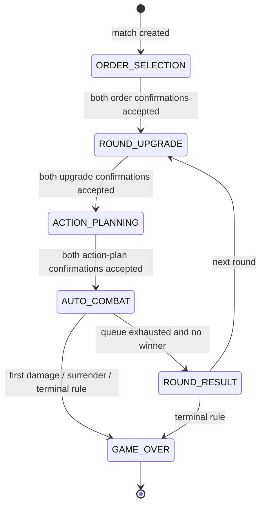

# MVP REST API and WebSocket Contract

## 1. Scope and authority

This contract defines the MVP communication between a React + TypeScript client (Redux Toolkit, RTK Query, React Router, and STOMP.js) and a Java Spring Boot server using STOMP over WebSocket and JWT authentication. A match contains exactly **two** players.

The server is authoritative. A client sends an intent command only. It must never calculate or submit official damage, HP, stats, technique outcomes, action execution order, phase transitions, or the winner. The client renders and stores the state received from the server.

Out of scope: matchmaking, ranking, spectators, chat, replay, guilds, shops, and all other non-MVP features.

### Core terms

| Term | Meaning |
| --- | --- |
| Order | A sword-fighting school. Each player selects exactly two; they grant HP, STR, SPD, DEF, and techniques. The server calculates initial stats. |
| Technique | An ability granted by an Order. |
| Action Plan | A player's ordered list of techniques for a round. |
| Execution Queue | The hidden server-side merged queue derived from both Action Plans. It is never sent in full to clients. |
| Public state | State visible to both match players and sent to a `/topic/...` destination. |
| Private state | A player's draft/preview/acknowledgement, sent only to that authenticated player through `/user/queue/...`. |

The normal flow is:

```text
Register or Login → Connect WebSocket → Host or Join Room → Both Ready
→ Host Starts Match → Select Orders → Upgrade Phase → Action Planning
→ Auto Combat → Match Result
```

## 2. Transport, authentication, and conventions

### 2.1 HTTP

All REST endpoints are rooted at `/api`. Use `Content-Type: application/json` for bodies. Protected endpoints require:

```http
Authorization: Bearer <access-token>
```

`POST /api/auth/refresh` uses the refresh token in its body. `POST /api/auth/logout` accepts the refresh token to revoke. In production, use HTTPS only.

### 2.2 WebSocket/STOMP

Connect to `/ws` only after a successful register/login/refresh. STOMP.js sends the access token in the `CONNECT` frame:

```ts
const client = new Client({
  brokerURL: 'wss://api.example.com/ws',
  connectHeaders: { Authorization: `Bearer ${accessToken}` },
});
```

The Spring WebSocket authentication interceptor validates the JWT during `CONNECT`, creates the authenticated `Principal`, and all message handlers derive the current player from that `Principal`. A client-supplied `playerId` is ignored and must not be trusted. In production use WSS only.

### 2.3 IDs, time, and idempotency

* All IDs are opaque strings. Timestamps are Unix epoch milliseconds (UTC).
* `commandId` is a UUID generated once per user intent and retained for retries. The server stores a bounded idempotency record per player/command scope and returns/replays the first outcome for duplicates; it must not apply the command twice.
* A command’s routing `roomId` or `matchId` must match the same ID in its envelope when both are present.
* JSON fields use camelCase. Omitted optional fields are absent, not `null`, unless an example explicitly shows `null`.

## 3. REST API

### 3.1 Common REST response and errors

Successful endpoints return the documented body. Non-2xx responses use this shape:

```json
{
  "error": {
    "code": "ROOM_FULL",
    "message": "The room already has two players.",
    "details": { "roomCode": "A7K9Q2" },
    "traceId": "trace-uuid"
  }
}
```

`details` is optional. Validation failures use `VALIDATION_ERROR` and may include field messages. Authentication failures use `UNAUTHORIZED`, `TOKEN_EXPIRED`, or `INVALID_TOKEN` as applicable.

### 3.2 Authentication

| Method and path | Auth | Request body | Success response | Errors | Example |
| --- | --- | --- | --- | --- | --- |
| `POST /api/auth/register` | No | `username`, `password` | `201` Auth session | `400 VALIDATION_ERROR`, `409 VALIDATION_ERROR` | [Register](#register-example) |
| `POST /api/auth/login` | No | `username`, `password` | `200` Auth session | `400 VALIDATION_ERROR`, `401 UNAUTHORIZED` | [Login](#login-example) |
| `POST /api/auth/refresh` | No | `refreshToken` | `200` Auth session / rotated tokens | `401 UNAUTHORIZED`, `TOKEN_EXPIRED`, `INVALID_TOKEN` | [Refresh](#refresh-example) |
| `POST /api/auth/logout` | Bearer access token | `refreshToken` | `204 No Content` | `401 UNAUTHORIZED`, `INVALID_TOKEN` | [Logout](#logout-example) |
| `GET /api/auth/me` | Bearer access token | None | `200` current user | `401 UNAUTHORIZED`, `TOKEN_EXPIRED`, `INVALID_TOKEN` | [Me](#me-example) |

#### Register example

```json
// request
{ "username": "Hai", "password": "StrongPassword123!" }

// 201 response
{
  "accessToken": "jwt-access-token",
  "refreshToken": "refresh-token",
  "user": { "userId": "user-001", "username": "Hai" }
}
```

#### Login example

```json
// request
{ "username": "Hai", "password": "StrongPassword123!" }

// 200 response
{
  "accessToken": "jwt-access-token",
  "refreshToken": "refresh-token",
  "user": { "userId": "user-001", "username": "Hai" }
}
```

#### Refresh example

```json
// request
{ "refreshToken": "refresh-token" }

// 200 response
{
  "accessToken": "rotated-jwt-access-token",
  "refreshToken": "rotated-refresh-token",
  "user": { "userId": "user-001", "username": "Hai" }
}
```

#### Logout example

```json
// request
{ "refreshToken": "refresh-token" }

// 204 response: no body
```

#### Me example

```json
// 200 response
{ "userId": "user-001", "username": "Hai" }
```

### 3.3 Static game data

Static data is public after authentication. It is immutable for the duration of a match; match snapshots identify the applicable static-data version if the server needs to evolve it.

| Method and path | Auth | Request body | Success response | Errors | Example |
| --- | --- | --- | --- | --- | --- |
| `GET /api/orders` | Bearer | None | `200` `OrderSummary[]` | `401 UNAUTHORIZED` | [Orders](#orders-example) |
| `GET /api/orders/{orderId}` | Bearer | None | `200` `OrderDetail` | `401 UNAUTHORIZED`, `404 ORDER_NOT_FOUND` | [Order](#order-example) |
| `GET /api/techniques` | Bearer | None | `200` `Technique[]` | `401 UNAUTHORIZED` | [Techniques](#techniques-example) |
| `GET /api/techniques/{techniqueId}` | Bearer | None | `200` `Technique` | `401 UNAUTHORIZED`, `404 TECHNIQUE_NOT_AVAILABLE` | [Technique](#technique-example) |

#### Orders example

```json
// GET /api/orders
[
  { "orderId": "heaven-sword-order", "name": "Heaven Sword", "description": "Balanced sword school." }
]
```

#### Order example

```json
// GET /api/orders/heaven-sword-order
{
  "orderId": "heaven-sword-order",
  "name": "Heaven Sword",
  "description": "Balanced sword school.",
  "bonuses": { "hp": 20, "str": 3, "spd": 2, "def": 2 },
  "techniqueIds": ["quick-slash", "heaven-guard"]
}
```

#### Techniques example

```json
// GET /api/techniques
[
  { "techniqueId": "quick-slash", "name": "Quick Slash", "description": "A swift attack.", "maxLevel": 3 }
]
```

#### Technique example

```json
// GET /api/techniques/quick-slash
{
  "techniqueId": "quick-slash",
  "name": "Quick Slash",
  "description": "A swift attack.",
  "maxLevel": 3,
  "sourceOrderIds": ["heaven-sword-order"]
}
```

### 3.4 Room

Creating a room makes the requester its host and its first player. Joining uses a room code; after a successful REST join (or `JOIN_ROOM` command), the server sends `JOIN_ROOM_ACCEPTED` privately to the joiner's `/user/queue/room-events` subscription before broadcasting the updated public room state. The REST response mirrors that acceptance for HTTP callers. Clients should still request a snapshot after navigation/reload.

| Method and path | Auth | Request body | Success response | Errors | Example |
| --- | --- | --- | --- | --- | --- |
| `POST /api/rooms` | Bearer | None | `201` host room state | `401 UNAUTHORIZED`, `VALIDATION_ERROR` | [Create room](#create-room-example) |
| `POST /api/rooms/join` | Bearer | `roomCode` | `200` private join acceptance and room state | `401 UNAUTHORIZED`, `ROOM_NOT_FOUND`, `ROOM_FULL`, `ROOM_ALREADY_STARTED` | [Join room](#join-room-example) |
| `GET /api/rooms/{roomId}` | Bearer + membership | None | `200` room state | `401 UNAUTHORIZED`, `ROOM_NOT_FOUND`, `PLAYER_NOT_IN_MATCH` | [Room](#room-example) |

#### Create room example

```json
// POST /api/rooms
// 201 response
{
  "roomId": "room-001",
  "roomCode": "A7K9Q2",
  "roomVersion": 1,
  "status": "WAITING_FOR_PLAYER",
  "hostPlayerId": "user-001",
  "players": [{ "playerId": "user-001", "username": "Hai", "ready": false }]
}
```

#### Join room example

```json
// request
{ "roomCode": "A7K9Q2" }

// 200 response
{
  "type": "JOIN_ROOM_ACCEPTED",
  "roomId": "room-001",
  "roomVersion": 2,
  "room": {
    "roomId": "room-001", "roomCode": "A7K9Q2", "status": "OPEN",
    "hostPlayerId": "user-001",
    "players": [
      { "playerId": "user-001", "username": "Hai", "ready": false },
      { "playerId": "user-002", "username": "Linh", "ready": false }
    ]
  }
}
```

#### Room example

```json
// GET /api/rooms/room-001
{
  "roomId": "room-001", "roomCode": "A7K9Q2", "roomVersion": 4,
  "status": "OPEN", "hostPlayerId": "user-001",
  "players": [
    { "playerId": "user-001", "username": "Hai", "ready": true },
    { "playerId": "user-002", "username": "Linh", "ready": true }
  ]
}
```

### 3.5 Match and result

Only a match participant may read its state or result. `GET /result` returns a result only after the match ends; before then it returns `409 INVALID_MATCH_PHASE`.

| Method and path | Auth | Request body | Success response | Errors | Example |
| --- | --- | --- | --- | --- | --- |
| `GET /api/matches/{matchId}` | Bearer + membership | None | `200` public match snapshot | `401 UNAUTHORIZED`, `MATCH_NOT_FOUND`, `PLAYER_NOT_IN_MATCH` | [Match](#match-example) |
| `GET /api/matches/{matchId}/result` | Bearer + membership | None | `200` match result | `401 UNAUTHORIZED`, `MATCH_NOT_FOUND`, `PLAYER_NOT_IN_MATCH`, `INVALID_MATCH_PHASE` | [Result](#result-example) |

#### Match example

```json
// GET /api/matches/match-001
{
  "matchId": "match-001", "matchVersion": 7,
  "phase": "ROUND_UPGRADE", "roundNumber": 1,
  "phaseStartedAt": 1783770000000, "phaseDeadlineAt": 1783770060000,
  "serverTime": 1783770001000,
  "players": [
    { "playerId": "user-001", "username": "Hai", "publicState": { "hp": 120, "str": 8, "spd": 5, "def": 4 } },
    { "playerId": "user-002", "username": "Linh", "publicState": { "hp": 110, "str": 7, "spd": 7, "def": 3 } }
  ]
}
```

#### Result example

```json
// GET /api/matches/match-001/result
{
  "matchId": "match-001", "matchVersion": 22,
  "winnerPlayerId": "user-001", "loserPlayerId": "user-002",
  "reason": "FIRST_DAMAGE", "endedAt": 1783770101500,
  "finalPlayers": [
    { "playerId": "user-001", "hp": 120 },
    { "playerId": "user-002", "hp": 92 }
  ]
}
```

## 4. STOMP destinations and envelopes

### 4.1 Destination table

| Direction | Destination | Purpose | Visibility |
| --- | --- | --- | --- |
| Client → server | `/app/rooms/join` | Join by room code | Authenticated caller |
| Client → server | `/app/rooms/{roomId}/leave` | Leave the room | Caller; server checks membership |
| Client → server | `/app/rooms/{roomId}/ready` | Change caller readiness | Caller; server checks membership |
| Client → server | `/app/rooms/{roomId}/start` | Start a room match | Host only |
| Client → server | `/app/rooms/{roomId}/request-snapshot` | Request current room snapshot | Room member |
| Client → server | `/app/matches/{matchId}/select-orders` | Save exactly two selected orders | Match player, `ORDER_SELECTION` |
| Client → server | `/app/matches/{matchId}/confirm-orders` | Confirm selected orders | Match player, `ORDER_SELECTION` |
| Client → server | `/app/matches/{matchId}/submit-upgrade-draft` | Save private upgrade draft | Match player, `ROUND_UPGRADE` |
| Client → server | `/app/matches/{matchId}/confirm-upgrades` | Confirm private upgrade draft | Match player, `ROUND_UPGRADE` |
| Client → server | `/app/matches/{matchId}/submit-action-plan-draft` | Save private action-plan draft | Match player, `ACTION_PLANNING` |
| Client → server | `/app/matches/{matchId}/confirm-action-plan` | Confirm private action plan | Match player, `ACTION_PLANNING` |
| Client → server | `/app/matches/{matchId}/request-snapshot` | Request public match snapshot | Match player |
| Client → server | `/app/matches/{matchId}/request-private-snapshot` | Request caller's private match snapshot | Match player |
| Client → server | `/app/matches/{matchId}/surrender` | End the match as caller's surrender | Match player, before `GAME_OVER` |
| Server → client | `/topic/rooms/{roomId}` | Ordered public room events | Both current room players |
| Server → client | `/topic/matches/{matchId}` | Ordered public match events | Both current match players |
| Server → client | `/user/queue/room-events` | Private room acceptance/snapshot | Authenticated recipient only |
| Server → client | `/user/queue/match-events` | Private match drafts/previews/snapshot | Authenticated recipient only |
| Server → client | `/user/queue/errors` | Rejections not tied to another private stream | Authenticated recipient only |

Spring resolves `/user/queue/...` against the JWT `Principal`; clients subscribe to the literal `/user/queue/...` destinations, never another user's resolved broker address. Authorization must also prevent arbitrary subscriptions to room/match topics.

### 4.2 Envelopes

Every command uses this envelope. `roomId` is used for room commands and `matchId` for match commands; the unused ID is omitted. `expectedRoomVersion` is used for room mutations. `expectedMatchVersion` is used for match mutations. Snapshot requests may omit the expected version.

```json
{
  "commandId": "command-uuid",
  "type": "SUBMIT_ACTION_PLAN_DRAFT",
  "matchId": "match-001",
  "expectedMatchVersion": 12,
  "privateRevision": 3,
  "clientTime": 1783770000000,
  "payload": {}
}
```

Every event uses this envelope. `roomVersion` is present on room public events; `matchVersion` is present on match public events. Private match events include `privateRevision`. `correlationId` is the originating command ID when there is one.

```json
{
  "eventId": "event-uuid",
  "type": "ACTION_RESOLVED",
  "matchId": "match-001",
  "matchVersion": 20,
  "serverTime": 1783770000000,
  "correlationId": "command-uuid",
  "payload": {}
}
```

### 4.3 Version, revision, and snapshots

`roomVersion` increases for every public room-state change. `matchVersion` increases for every public match-state or phase change. The private `privateRevision` increases only when the authenticated player's private draft/confirmation state changes. A private draft change must not increase `matchVersion`.

For a public stream, the Redux reducer applies these rules:

```text
event.version <= currentVersion       → ignore (duplicate/old)
event.version == currentVersion + 1   → apply
event.version > currentVersion + 1    → request snapshot, do not infer missing state
```

Snapshots replace the relevant slice atomically and set its version/revision:

| Event | Destination | Use |
| --- | --- | --- |
| `ROOM_SNAPSHOT` | `/user/queue/room-events` | Entering, reload, reconnect, or room version gap |
| `MATCH_SNAPSHOT` | `/topic/matches/{matchId}` (or HTTP match GET) | Entering, reload, reconnect, or public match gap |
| `PRIVATE_MATCH_SNAPSHOT` | `/user/queue/match-events` | Entering, reload, reconnect, or private revision gap |

Request both public and private match snapshots after subscribing. The public snapshot must contain no private draft. The private snapshot contains only the requesting player's draft and acknowledgement state.

## 5. Room commands and events

### 5.1 Commands

| Command | Destination | Payload | Server validation | Response |
| --- | --- | --- | --- | --- |
| `JOIN_ROOM` | `/app/rooms/join` | `{ "roomCode": "A7K9Q2" }` | JWT, room exists, caller is not already in a different active room, room has fewer than two players, not started | Private `JOIN_ROOM_ACCEPTED`, then public events |
| `LEAVE_ROOM` | `/app/rooms/{roomId}/leave` | `{}` | JWT, membership, room is not started | Public `PLAYER_LEFT_ROOM`/`ROOM_CLOSED` |
| `SET_ROOM_READY` | `/app/rooms/{roomId}/ready` | `{ "ready": true }` | JWT, membership, room open, expected room version | Public `PLAYER_READY_CHANGED`, `ROOM_STATE_UPDATED` |
| `START_MATCH` | `/app/rooms/{roomId}/start` | `{}` | JWT, caller is host, exactly two players, both ready, room open, expected room version | Public `MATCH_CREATED` |
| `REQUEST_ROOM_SNAPSHOT` | `/app/rooms/{roomId}/request-snapshot` | `{}` | JWT and room membership | Private `ROOM_SNAPSHOT` |

Host creation is REST (`POST /api/rooms`) and does not require a room command. A client may use REST join or `JOIN_ROOM`; both obey the same rules and result semantics.

### 5.2 Events

| Event | Destination | Visibility | Payload summary |
| --- | --- | --- | --- |
| `JOIN_ROOM_ACCEPTED` | `/user/queue/room-events` | Joiner only | `roomId`, `roomCode`, `roomVersion`, `room` |
| `ROOM_SNAPSHOT` | `/user/queue/room-events` | Requester only | Complete current public `room` |
| `ROOM_STATE_UPDATED` | `/topic/rooms/{roomId}` | Both players | Complete public `room` |
| `PLAYER_JOINED_ROOM` | `/topic/rooms/{roomId}` | Both players | `player`, complete `room` |
| `PLAYER_LEFT_ROOM` | `/topic/rooms/{roomId}` | Remaining player(s) | `playerId`, complete `room` |
| `PLAYER_READY_CHANGED` | `/topic/rooms/{roomId}` | Both players | `playerId`, `ready`, complete `room` |
| `ROOM_CLOSED` | `/topic/rooms/{roomId}` | Current subscribers | `reason` (`HOST_LEFT` or `EMPTY`) |
| `MATCH_CREATED` | `/topic/rooms/{roomId}` | Both players | `matchId`, `roomId`, `matchVersion`, `phase` |
| `COMMAND_REJECTED` | `/user/queue/room-events` or `/user/queue/errors` | Caller only | Standard rejection payload |

`MATCH_CREATED` causes both clients to navigate to `/battle/{matchId}`, subscribe to `/topic/matches/{matchId}`, then request both match snapshots.

## 6. Match phases and state machine

The server alone changes phase. Every public phase-bearing event and match snapshot includes:

```json
{
  "phase": "ACTION_PLANNING",
  "roundNumber": 1,
  "phaseStartedAt": 1783770060000,
  "phaseDeadlineAt": 1783770120000,
  "serverTime": 1783770060010,
  "matchVersion": 12
}
```

`phaseDeadlineAt` may be `null` only for a terminal `GAME_OVER` state. A timeout is server-owned; clients may display a countdown from `serverTime`, but cannot conclude a phase themselves.



### 6.1 Match commands

| Command | Destination | Payload | Required phase and validation | Private acknowledgement / public outcome |
| --- | --- | --- | --- | --- |
| `SELECT_ORDERS` | `/app/matches/{matchId}/select-orders` | `{ "orderIds": ["heaven-sword-order", "dragon-sword-order"] }` | `ORDER_SELECTION`; caller is player; match version current; exactly two distinct existing orders | Private `ORDER_SELECTION_ACCEPTED` with selected IDs/revision |
| `CONFIRM_ORDERS` | `/app/matches/{matchId}/confirm-orders` | `{}` | `ORDER_SELECTION`; caller has valid draft; current version/revision | Private `ORDER_SELECTION_CONFIRM_ACCEPTED`; when both confirm, public resolve |
| `SUBMIT_UPGRADE_DRAFT` | `/app/matches/{matchId}/submit-upgrade-draft` | `UpgradeDraft` | `ROUND_UPGRADE`; caller/player/version/revision; points/targets/techniques valid | Private `UPGRADE_DRAFT_ACCEPTED` with preview/revision |
| `CONFIRM_UPGRADES` | `/app/matches/{matchId}/confirm-upgrades` | `{}` | `ROUND_UPGRADE`; valid current draft; caller/player/version/revision | Private `UPGRADES_CONFIRM_ACCEPTED`; public confirmation/resolution |
| `SUBMIT_ACTION_PLAN_DRAFT` | `/app/matches/{matchId}/submit-action-plan-draft` | `{ "techniqueIds": ["quick-slash", "heaven-guard"] }` | `ACTION_PLANNING`; exact count; technique owned and available; later-round history rule; caller/player/version/revision | Private `ACTION_PLAN_DRAFT_ACCEPTED` |
| `CONFIRM_ACTION_PLAN` | `/app/matches/{matchId}/confirm-action-plan` | `{}` | `ACTION_PLANNING`; valid current draft; caller/player/version/revision | Private `ACTION_PLAN_CONFIRM_ACCEPTED`; then public combat start |
| `REQUEST_MATCH_SNAPSHOT` | `/app/matches/{matchId}/request-snapshot` | `{}` | Caller is match player | Public `MATCH_SNAPSHOT` to topic (or direct equivalent with identical public payload) |
| `REQUEST_PRIVATE_SNAPSHOT` | `/app/matches/{matchId}/request-private-snapshot` | `{}` | Caller is match player | Private `PRIVATE_MATCH_SNAPSHOT` |
| `SURRENDER` | `/app/matches/{matchId}/surrender` | `{}` | Caller is match player; not `GAME_OVER` | Public `MATCH_ENDED` with `SURRENDER` |

### 6.2 Order selection events

Order selections may remain private until both players confirm. Once resolved, public state shows only official calculated stats and available techniques, not a private draft history.

| Event | Destination | Visibility | Payload summary |
| --- | --- | --- | --- |
| `ORDER_SELECTION_ACCEPTED` | `/user/queue/match-events` | Caller | `selectedOrderIds`, `privateRevision`, `confirmed: false` |
| `ORDER_SELECTION_CONFIRM_ACCEPTED` | `/user/queue/match-events` | Caller | `privateRevision`, `confirmed: true` |
| `ORDER_SELECTION_RESOLVED` | `/topic/matches/{matchId}` | Both players | public player stats/techniques, next phase metadata |

### 6.3 Hidden upgrade phase

At phase start the public `UPGRADE_PHASE_STARTED` event supplies `upgradePoints` (`X`) and eligible public upgrade options, but never another player's draft. An upgrade draft represents point allocation, for example:

```json
{
  "allocations": [
    { "target": "HP", "points": 2 },
    { "target": "STR", "points": 1 },
    { "target": "TECHNIQUE_LEVEL", "techniqueId": "quick-slash", "points": 1 }
  ]
}
```

Allowed targets are `HP`, `STR`, `SPD`, `DEF`, and `TECHNIQUE_LEVEL` (which requires a caller-owned available `techniqueId`). Total allocated points must be at most `X`; server policy may require exactly `X` before confirmation. The private acceptance includes a server-calculated preview for the caller only. It is not official until both drafts are confirmed.

| Event | Destination | Visibility | Payload summary |
| --- | --- | --- | --- |
| `UPGRADE_PHASE_STARTED` | `/topic/matches/{matchId}` | Both | phase metadata, `upgradePoints`, current public states |
| `UPGRADE_DRAFT_ACCEPTED` | `/user/queue/match-events` | Caller | normalized draft, official-server preview, `privateRevision` |
| `UPGRADES_CONFIRM_ACCEPTED` | `/user/queue/match-events` | Caller | `confirmed: true`, `privateRevision` |
| `PLAYER_CONFIRMATION_CHANGED` | `/topic/matches/{matchId}` | Both | `playerId`, confirmation kind, `confirmed`; no draft |
| `UPGRADE_PHASE_RESOLVED` | `/topic/matches/{matchId}` | Both | atomically applied official public stats and technique levels |
| `ACTION_PLANNING_STARTED` | `/topic/matches/{matchId}` | Both | phase metadata, `requiredActionCount` |
| `PRIVATE_COMMAND_REJECTED` | `/user/queue/match-events` | Caller | rejection code/message/correlation and current private revision |

On both confirmations, the server atomically applies both drafts, calculates official stats, increments `matchVersion`, broadcasts `UPGRADE_PHASE_RESOLVED`, then starts `ACTION_PLANNING` in a new public version/event. No upgrade draft is ever put on the topic.

### 6.4 Hidden action planning

Required counts are server rules exposed in `ACTION_PLANNING_STARTED`: round 1 requires 2 actions, round 2 requires 3, and round 3 requires 4. The server can include the exact `requiredActionCount` for every round, making the contract extensible.

Round 1 accepts exactly the required number of caller-owned available techniques. In later rounds, the draft must retain the previous round’s plan except that it may remove at most one old action; retained actions must stay in the same relative order, while new techniques can be inserted. For previous `[A, B]`, `[A, C, B]` is valid and `[B, C, A]` is invalid.

| Event | Destination | Visibility | Payload summary |
| --- | --- | --- | --- |
| `ACTION_PLAN_DRAFT_ACCEPTED` | `/user/queue/match-events` | Caller | normalized `techniqueIds`, `privateRevision`, `confirmed: false` |
| `ACTION_PLAN_CONFIRM_ACCEPTED` | `/user/queue/match-events` | Caller | `privateRevision`, `confirmed: true` |
| `PLAYER_CONFIRMATION_CHANGED` | `/topic/matches/{matchId}` | Both | only confirmation signal, never plan content |
| `COMBAT_STARTED` | `/topic/matches/{matchId}` | Both | phase metadata, round number, public states; never queue |

When both players confirm, the server locks both plans and constructs its hidden Execution Queue. It may use official speed and other rules to determine execution order, but must never publish the complete queue, its future order, or unrevealed actions.

### 6.5 Auto combat and match end

The server reveals and resolves exactly one action at a time:

```text
Reveal Action → client plays animation → server resolves technique
→ broadcasts official result → checks end → reveals next action
```

| Event | Destination | Payload summary |
| --- | --- | --- |
| `COMBAT_STARTED` | `/topic/matches/{matchId}` | phase metadata, round and public state |
| `ACTION_REVEALED` | `/topic/matches/{matchId}` | one current execution record and `resolveAt` |
| `ACTION_RESOLVED` | `/topic/matches/{matchId}` | authoritative effects and both public states after resolution |
| `ROUND_ENDED` | `/topic/matches/{matchId}` | complete public round state; next phase or next round metadata |
| `MATCH_ENDED` | `/topic/matches/{matchId}` | authoritative result, final states, terminal phase |

Example action reveal:

```json
{
  "type": "ACTION_REVEALED",
  "matchId": "match-001",
  "matchVersion": 20,
  "serverTime": 1783770000000,
  "payload": {
    "executionId": "execution-001",
    "actionIndex": 0,
    "sourcePlayerId": "player-a",
    "targetPlayerId": "player-b",
    "techniqueId": "quick-slash",
    "revealedAt": 1783770000000,
    "resolveAt": 1783770001500
  }
}
```

Example action resolution:

```json
{
  "type": "ACTION_RESOLVED",
  "matchId": "match-001",
  "matchVersion": 21,
  "serverTime": 1783770001500,
  "payload": {
    "executionId": "execution-001",
    "techniqueId": "quick-slash",
    "result": {
      "status": "SUCCESS",
      "effects": [{ "type": "DAMAGE", "value": 18 }]
    },
    "sourceStateAfter": { "hp": 120, "str": 8, "spd": 5, "def": 4 },
    "targetStateAfter": { "hp": 92, "str": 7, "spd": 7, "def": 3 },
    "matchResult": null
  }
}
```

The current MVP end rule is **the first player who loses HP loses**. The terminal result reason is `FIRST_DAMAGE`. After its first official HP-loss resolution, the server stops the queue, cancels all unrevealed actions, sets `GAME_OVER`, increments `matchVersion`, and broadcasts `MATCH_ENDED`. Clients navigate to `/results/{matchId}` (or the project’s equivalent result route) based only on that event. The result enum remains extensible: `FIRST_DAMAGE`, `HP_REACHED_ZERO`, `SURRENDER`, `TIMEOUT`, `DISCONNECTED`, `DRAW`.

## 7. TypeScript contract examples

```ts
export type MatchPhase =
  | 'ORDER_SELECTION' | 'ROUND_UPGRADE' | 'ACTION_PLANNING'
  | 'AUTO_COMBAT' | 'ROUND_RESULT' | 'GAME_OVER';

export type ErrorCode =
  | 'UNAUTHORIZED' | 'TOKEN_EXPIRED' | 'INVALID_TOKEN'
  | 'ROOM_NOT_FOUND' | 'ROOM_FULL' | 'ROOM_ALREADY_STARTED' | 'NOT_ROOM_HOST' | 'PLAYERS_NOT_READY'
  | 'MATCH_NOT_FOUND' | 'PLAYER_NOT_IN_MATCH' | 'INVALID_MATCH_PHASE' | 'STALE_MATCH_VERSION' | 'STALE_PRIVATE_REVISION'
  | 'ORDER_SELECTION_COUNT_INVALID' | 'ORDER_NOT_FOUND'
  | 'UPGRADE_POINTS_EXCEEDED' | 'INVALID_UPGRADE_TARGET' | 'TECHNIQUE_NOT_AVAILABLE'
  | 'ACTION_COUNT_INVALID' | 'ACTION_REMOVAL_LIMIT_REACHED' | 'ACTION_ORDER_INVALID' | 'ACTION_TARGET_INVALID'
  | 'COMMAND_ALREADY_PROCESSED' | 'VALIDATION_ERROR' | 'INTERNAL_SERVER_ERROR';

export interface ClientCommand<TPayload = Record<string, never>> {
  commandId: string;
  type: string;
  roomId?: string;
  matchId?: string;
  expectedRoomVersion?: number;
  expectedMatchVersion?: number;
  privateRevision?: number;
  clientTime: number;
  payload: TPayload;
}

export interface ServerEvent<TPayload = unknown> {
  eventId: string;
  type: string;
  roomId?: string;
  matchId?: string;
  roomVersion?: number;
  matchVersion?: number;
  privateRevision?: number;
  serverTime: number;
  correlationId?: string;
  payload: TPayload;
}

export interface PhaseState {
  phase: MatchPhase;
  roundNumber: number;
  phaseStartedAt: number;
  phaseDeadlineAt: number | null;
  serverTime: number;
  matchVersion: number;
}

export interface UpgradeAllocation {
  target: 'HP' | 'STR' | 'SPD' | 'DEF' | 'TECHNIQUE_LEVEL';
  techniqueId?: string;
  points: number;
}

export interface UpgradeDraft { allocations: UpgradeAllocation[] }
export interface ActionPlanDraft { techniqueIds: string[] }

export interface PublicPlayerState {
  playerId: string;
  username: string;
  publicState: { hp: number; str: number; spd: number; def: number; techniqueLevels?: Record<string, number> };
}

export interface MatchSnapshot extends PhaseState {
  matchId: string;
  players: PublicPlayerState[];
}
```

Suggested client ownership: RTK Query caches REST auth/static data/GET snapshots; a `roomSlice` and `matchSlice` apply STOMP events in version order; an auth slice owns tokens and current user. On STOMP reconnect, re-subscribe then dispatch snapshot-request commands before accepting incremental events. React Router owns navigation to `/room/{roomId}`, `/battle/{matchId}`, and `/results/{matchId}`.

## 8. Java DTO/record examples

```java
public record ClientCommand<T>(
    UUID commandId,
    String type,
    String roomId,
    String matchId,
    Long expectedRoomVersion,
    Long expectedMatchVersion,
    Long privateRevision,
    long clientTime,
    T payload
) {}

public record ServerEvent<T>(
    UUID eventId,
    String type,
    String roomId,
    String matchId,
    Long roomVersion,
    Long matchVersion,
    Long privateRevision,
    long serverTime,
    UUID correlationId,
    T payload
) {}

public record SelectOrdersPayload(List<String> orderIds) {}
public record ActionPlanDraftPayload(List<String> techniqueIds) {}
public record UpgradeAllocation(String target, String techniqueId, int points) {}
public record UpgradeDraftPayload(List<UpgradeAllocation> allocations) {}

public record ApiError(String code, String message, Map<String, Object> details, String traceId) {}
public record ApiErrorResponse(ApiError error) {}
```

Handlers must obtain the player ID from `Principal`, for example `principal.getName()`, then load membership and state server-side. The payload records deliberately contain no `playerId`.

## 9. Error codes

| Code | Meaning / normal transport |
| --- | --- |
| `UNAUTHORIZED` | Missing authentication; REST `401` or private command rejection |
| `TOKEN_EXPIRED` | Access/refresh JWT expired; REST `401` or connection rejected |
| `INVALID_TOKEN` | Malformed, revoked, or invalid token; REST `401` or connection rejected |
| `ROOM_NOT_FOUND` | Unknown or closed room ID/code |
| `ROOM_FULL` | Room already has two players |
| `ROOM_ALREADY_STARTED` | Join/room operation is not allowed after start |
| `NOT_ROOM_HOST` | Only the host may start |
| `PLAYERS_NOT_READY` | Start requires exactly two ready players |
| `MATCH_NOT_FOUND` | Unknown match ID |
| `PLAYER_NOT_IN_MATCH` | Authenticated principal is not a room/match member |
| `INVALID_MATCH_PHASE` | Command or result read is invalid for current phase |
| `STALE_MATCH_VERSION` | `expectedMatchVersion` differs from public current version |
| `STALE_PRIVATE_REVISION` | Submitted private revision differs from caller’s current revision |
| `ORDER_SELECTION_COUNT_INVALID` | Orders must contain exactly two distinct IDs |
| `ORDER_NOT_FOUND` | An order ID does not exist |
| `UPGRADE_POINTS_EXCEEDED` | Draft spends more than phase allowance |
| `INVALID_UPGRADE_TARGET` | Target is unsupported or technique target lacks a valid ID |
| `TECHNIQUE_NOT_AVAILABLE` | Technique is not granted/available to caller |
| `ACTION_COUNT_INVALID` | Plan does not have the required number of actions |
| `ACTION_REMOVAL_LIMIT_REACHED` | Later-round draft removed more than one previous action |
| `ACTION_ORDER_INVALID` | Retained old actions changed relative order |
| `ACTION_TARGET_INVALID` | Any unsupported target selection in an action command |
| `COMMAND_ALREADY_PROCESSED` | Duplicate `commandId`; server returns original acknowledgement when available |
| `VALIDATION_ERROR` | Malformed schema, missing field, invalid primitive, or invalid HTTP body |
| `INTERNAL_SERVER_ERROR` | Unexpected server fault; no authoritative state change is implied |

For STOMP errors, use the `COMMAND_REJECTED` or `PRIVATE_COMMAND_REJECTED` event envelope with:

```json
{
  "type": "PRIVATE_COMMAND_REJECTED",
  "matchId": "match-001",
  "matchVersion": 12,
  "privateRevision": 3,
  "correlationId": "command-uuid",
  "serverTime": 1783770000000,
  "payload": {
    "code": "STALE_PRIVATE_REVISION",
    "message": "Request a private snapshot before editing the draft again."
  }
}
```

## 10. Required end-to-end scenario

The following illustrates the complete MVP flow. `RV` means room version, `MV` match version, and `PR-A`/`PR-B` the respective player’s private revision.

| # | Actor and action | Endpoint / destination | Server validation | Response and versions | Redux / route update |
| --- | --- | --- | --- | --- | --- |
| 1 | A logs in | `POST /api/auth/login` | Credentials | `200` auth session | Auth slice stores A tokens/user |
| 2 | B logs in | `POST /api/auth/login` | Credentials | `200` auth session | Auth slice stores B tokens/user |
| 3 | Both connect | STOMP `CONNECT` to `/ws` with Bearer JWT | JWT becomes each `Principal` | CONNECTED frame | WebSocket service marks connected |
| 4 | A hosts room | `POST /api/rooms` | A authenticated | `201`, room `RV=1` | Room slice stores host room; A subscribes `/topic/rooms/room-001` |
| 5 | B joins by code | `POST /api/rooms/join` (or `/app/rooms/join`) | Exists, open, one player only | Private `JOIN_ROOM_ACCEPTED`; public `PLAYER_JOINED_ROOM`, `RV=2` | B stores room, subscribes topic; both apply public state |
| 6 | Both become ready | `/app/rooms/room-001/ready` twice | Member, open, expected RV | Public `PLAYER_READY_CHANGED`, then state, RV increments per change | Both room reducers update readiness |
| 7 | A starts match | `/app/rooms/room-001/start` | Principal is host; two ready players | Public `MATCH_CREATED`, initial `MV=1`, phase `ORDER_SELECTION` | Both navigate `/battle/match-001` |
| 8 | Both subscribe | `/topic/matches/match-001` | Subscription authorization by membership | Public stream available | Match event listener registers |
| 9 | Both request snapshots | `/app/matches/match-001/request-snapshot` and `/request-private-snapshot` | Membership | `MATCH_SNAPSHOT` at MV=1 and per-user `PRIVATE_MATCH_SNAPSHOT`, PR=0 | Public/private match slices replace state |
| 10 | Both choose two orders | `/app/matches/match-001/select-orders` | Phase, membership, MV=1, PR current, exactly two existing distinct orders | Private `ORDER_SELECTION_ACCEPTED`; PR increments for each caller | Own private draft state updates only |
| 11 | Both confirm orders | `/app/matches/match-001/confirm-orders` | Valid own draft and revisions | Private confirms; after B, public `ORDER_SELECTION_RESOLVED`, MV increments and phase `ROUND_UPGRADE` | Clear private order draft; apply official stats/phase |
| 12 | Round 1 starts | Server transition | Both order confirms | `UPGRADE_PHASE_STARTED`, MV increments, round 1, X points | Both display upgrade phase/countdown |
| 13 | Both submit upgrades | `/app/matches/match-001/submit-upgrade-draft` | Phase, MV, PR, points/targets/techniques | Private `UPGRADE_DRAFT_ACCEPTED`, each PR increments; preview only | Own private upgrade draft/preview updates |
| 14 | Both confirm upgrades | `/app/matches/match-001/confirm-upgrades` | Valid own draft, expected MV/PR | Private confirm; public confirmation signals (MV increments if public) | Own confirmation and opponent public confirmation update |
| 15 | Server applies upgrades | Server transition | Both confirmations | `UPGRADE_PHASE_RESOLVED`, then `ACTION_PLANNING_STARTED`; MV increments for each public change | Apply official public stats and action count; clear upgrade drafts |
| 16 | Both submit plans | `/app/matches/match-001/submit-action-plan-draft` | Phase, MV, PR, exact count and ownership/history rules | Private `ACTION_PLAN_DRAFT_ACCEPTED`, PR increments | Own private plan updates; opponent sees nothing |
| 17 | Both confirm plans | `/app/matches/match-001/confirm-action-plan` | Valid own plan/current revisions | Private confirms; server locks plans and queue | Own confirmation updates only |
| 18 | Server starts combat | Server transition | Both confirms | Public `COMBAT_STARTED`, MV increments; queue stays hidden | Apply `AUTO_COMBAT` phase |
| 19 | Server reveals technique | Server timer | Queue has next action; match active | `ACTION_REVEALED`, MV increments | Store active animation from event only |
| 20 | Server resolves it | Server timer | Official technique rules | `ACTION_RESOLVED`, MV increments, states after result | Replace/patch public stats from payload; never calculate damage |
| 21 | Server reveals next | Server timer | No terminal result and queue has action | next `ACTION_REVEALED`, MV increments | Replace active animation |
| 22 | A player loses HP first | Server resolution | First authoritative HP reduction | Determines loser/winner under `FIRST_DAMAGE` | Client waits for terminal event |
| 23 | Server ends match | Server transition | Cancels unrevealed queue actions | `MATCH_ENDED`, `GAME_OVER`, MV increments, reason `FIRST_DAMAGE` | Store final result; stop combat animation/timers |
| 24 | Both reach result | Client reacts to terminal event | N/A | May `GET /api/matches/match-001/result` for reload-safe page | Navigate `/results/match-001`; result query caches response |

### Sequence diagram

```mermaid
sequenceDiagram
  participant A as Player A client
  participant B as Player B client
  participant S as Spring Boot server
  A->>S: POST /api/auth/login
  B->>S: POST /api/auth/login
  A->>S: STOMP CONNECT Authorization: Bearer JWT
  B->>S: STOMP CONNECT Authorization: Bearer JWT
  A->>S: POST /api/rooms
  S-->>A: 201 room (RV 1)
  B->>S: POST /api/rooms/join {roomCode}
  S-->>B: /user/queue/room-events JOIN_ROOM_ACCEPTED
  S-->>A: /topic/rooms/{roomId} PLAYER_JOINED_ROOM (RV 2)
  S-->>B: /topic/rooms/{roomId} PLAYER_JOINED_ROOM (RV 2)
  A->>S: SET_ROOM_READY
  B->>S: SET_ROOM_READY
  A->>S: START_MATCH
  S-->>A: /topic/rooms/{roomId} MATCH_CREATED
  S-->>B: /topic/rooms/{roomId} MATCH_CREATED
  A->>S: subscribe /topic/matches/{matchId}; request snapshots
  B->>S: subscribe /topic/matches/{matchId}; request snapshots
  S-->>A: MATCH_SNAPSHOT + PRIVATE_MATCH_SNAPSHOT
  S-->>B: MATCH_SNAPSHOT + PRIVATE_MATCH_SNAPSHOT
  A->>S: SELECT_ORDERS, CONFIRM_ORDERS
  B->>S: SELECT_ORDERS, CONFIRM_ORDERS
  S-->>A: ORDER_SELECTION_RESOLVED / UPGRADE_PHASE_STARTED
  S-->>B: ORDER_SELECTION_RESOLVED / UPGRADE_PHASE_STARTED
  A->>S: private upgrade draft, confirm
  B->>S: private upgrade draft, confirm
  S-->>A: UPGRADE_PHASE_RESOLVED / ACTION_PLANNING_STARTED
  S-->>B: UPGRADE_PHASE_RESOLVED / ACTION_PLANNING_STARTED
  A->>S: private action plan, confirm
  B->>S: private action plan, confirm
  S-->>A: COMBAT_STARTED, ACTION_REVEALED, ACTION_RESOLVED
  S-->>B: COMBAT_STARTED, ACTION_REVEALED, ACTION_RESOLVED
  S-->>A: MATCH_ENDED (FIRST_DAMAGE)
  S-->>B: MATCH_ENDED (FIRST_DAMAGE)
```

## 11. Mandatory security and consistency rules

* Identify every REST and STOMP caller from JWT and `Principal`; never trust a client-supplied player identity.
* Check room/match membership on every command, read, subscription, and snapshot request; check host permission for start.
* Validate phase, expected public version, and private revision before mutating state. Reject stale mutations and require a snapshot before retrying.
* Publish private drafts, private previews, private revisions, and private acknowledgements only to `/user/queue/match-events`; never publish them to a room/match topic.
* Never expose the complete hidden Execution Queue, future action order, or unrevealed actions.
* The client never resolves official gameplay; it updates Redux from authoritative server snapshots and events only.
* Use `commandId` idempotency so retries cannot duplicate ready changes, starts, confirmations, upgrades, plans, or surrender.
* Use HTTPS and WSS in production, validate JWT expiration/revocation, and avoid logging access/refresh tokens.
