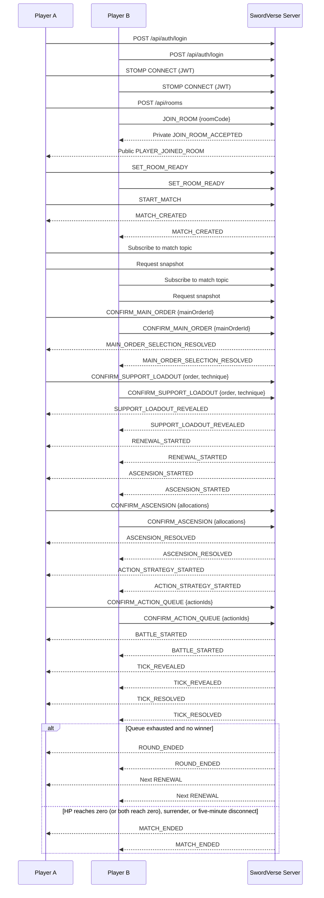

# SwordVerse API and WebSocket Contract

## Purpose and scope

This document defines the server-authoritative contract for SwordVerse 1.0, an online 1v1 round-based auto-combat game described in [README.md](README.md). It covers the React + TypeScript client (Redux Toolkit, RTK Query, React Router, STOMP.js) and the Spring Boot server (REST, STOMP over WebSocket, JWT).

Only two players can participate in a room or a match. The contract covers authentication, private rooms, pre-match Order selection, round progression, auto-combat, reconnects, and match results. Matchmaking, ranking, spectators, chat, replay, guilds, shops, and other features are intentionally excluded.

The server is authoritative. Clients submit player intent and render the returned state. Clients must not calculate or submit official damage, HP, STR, DEF, AS, MP, QP, effects, Action execution order, phase changes, or match results.

## Game rules represented by the contract

### Orders, Techniques, and Actions

Each player first secretly selects one **Main Order**. Once both confirm, the server reveals both Main Orders. Each player then secretly selects one **Support Order** and exactly one **Support Technique** belonging to that Support Order. Once both confirm, the server reveals both support loadouts and builds each player's available Action list:

```text
Basic Actions + 3 Main Techniques + 1 Support Technique
```

An Order supplies stats and Techniques. The public player state uses the README stat set:

| Stat | Meaning |
| --- | --- |
| `STR` | Damage potential |
| `HP` | Life; reaching zero loses the match |
| `DEF` | Damage reduction |
| `AS` | Attack speed used by server execution rules |
| `MP` | Resource used by Actions |
| `QP` | Resource used by selected Actions |

The server owns all formulas and the exact rules by which stats, costs, effects, and Action order are resolved.

### Match flow

```text
Login → WebSocket connect → Host or join room → both ready → match created
→ Main Order selection → Support Order/Technique selection
→ RENEWAL → ASCENSION → ACTION_STRATEGY → BATTLE
→ RENEWAL (next round) or GAME_OVER
```

Each round has the four README phases:

1. `RENEWAL`: server resolves active effects, converts remaining MP to QP at the Order-defined ratio, then fully restores MP.
2. `ASCENSION`: each player builds a local 2 Learning Point (LP) allocation, then submits it once as a confirmation. Both allocations resolve simultaneously.
3. `ACTION_STRATEGY`: each player builds a local Action Queue, then submits it once as a confirmation.
4. `BATTLE`: the server reveals and resolves both players' Actions together, tick by tick, and emits the Battle Log.

Action Queue length by round:

| Round | Required queue size |
| ---: | ---: |
| 1 | 2 |
| 2 | 3 |
| 3 | 4 |
| 4 | 5 |
| 5 | 6 |
| 6+ | 7 |

After round 1, a plan may remove at most one occurrence from the previous queue. The retained occurrences must keep their relative order; newly available Actions can be inserted at the beginning, end, or between retained occurrences.

The match ends immediately when HP reaches zero, a player surrenders, or a player has stayed disconnected for more than five minutes. Result reasons are `HP_REACHED_ZERO`, `SURRENDER`, `DISCONNECTED`, and `DRAW`. `DRAW` applies when both players' HP reach zero within the same tick — with simultaneous resolution, this is possible and neither side is treated as the winner.

### Battle execution order

Within a Round, both players' Action Queues execute in lockstep by position: the Action at index 0 of Player A's queue and index 0 of Player B's queue resolve together as one **tick**; then index 1; and so on, until both queues are exhausted. There is no turn alternation and no initiative — every tick involves both players simultaneously. An empty slot (from a timeout-locked queue) counts as "no Action" for that side that tick.

The outcome of a tick depends on the combination of both Actions, not either one in isolation — for example, two attacking Actions each damage the other player; an attack against a counter damages only the attacker; an attack against a guard damages neither player. These are only illustrative cases: Techniques cover a much wider range of effects (healing, resource restoration, Defense-ignoring damage, and other special interactions), and the server resolves the actual outcome of any pair of simultaneous Actions using each Action's configured effects — this is game-engine logic, not a fixed lookup of combat roles.

If a player's queued Action at a tick can't be afforded (insufficient MP/QP) or is disabled by an active effect, only that player's Action fails for the tick — it contributes no effect, while the opponent's Action (if any) still resolves normally against them.

## Authentication and transport

### REST authentication

Protected REST calls send:

```http
Authorization: Bearer <access-token>
Content-Type: application/json
```

The server issues a short-lived JWT access token and a refresh token. All production traffic uses HTTPS.

| Method | Path | Authentication | Request body | Success response | Errors |
| --- | --- | --- | --- | --- | --- |
| `POST` | `/api/auth/register` | None | `username`, `password` | `201` session | `VALIDATION_ERROR` |
| `POST` | `/api/auth/login` | None | `username`, `password` | `200` session | `UNAUTHORIZED`, `VALIDATION_ERROR` |
| `POST` | `/api/auth/refresh` | None | `refreshToken` | `200` rotated session | `TOKEN_EXPIRED`, `INVALID_TOKEN` |
| `POST` | `/api/auth/logout` | Bearer | `refreshToken` | `204` | `UNAUTHORIZED`, `INVALID_TOKEN` |
| `GET` | `/api/auth/me` | Bearer | None | `200` current user | `UNAUTHORIZED`, `TOKEN_EXPIRED`, `INVALID_TOKEN` |

```json
// POST /api/auth/login request
{ "username": "Hai", "password": "StrongPassword123!" }

// register, login, or refresh success response
{
  "accessToken": "jwt-access-token",
  "refreshToken": "refresh-token",
  "user": { "userId": "user-001", "username": "Hai" }
}
```

### STOMP connection

The client connects only after authentication, using the `/ws` endpoint. The JWT belongs in the STOMP `CONNECT` headers:

```ts
const stompClient = new Client({
  brokerURL: 'wss://api.example.com/ws',
  connectHeaders: { Authorization: `Bearer ${accessToken}` },
});
```

The server validates the token on `CONNECT` and constructs the Spring `Principal`. Every handler derives the player identity from that `Principal`; it must ignore any client-provided player ID. In production, use WSS.

**Token refresh during an open connection.** The STOMP session is validated only at `CONNECT` and is unaffected by the access token expiring afterward — the client refreshes it in the background via `POST /api/auth/refresh` over REST, and the existing WebSocket connection stays open and authenticated as-is. The refreshed token is only required the next time the client performs a new `CONNECT` (e.g., reconnecting after a network drop); it is never pushed into or re-validated against an already-open STOMP session.

## REST APIs

### Static game data

The client uses these read-only endpoints to show selections and tooltips. Static definitions must include enough display metadata, but not server-only combat formulas.

| Method | Path | Authentication | Request body | Success response | Errors |
| --- | --- | --- | --- | --- | --- |
| `GET` | `/api/orders` | Bearer | None | `200` Order summaries | `UNAUTHORIZED` |
| `GET` | `/api/orders/{orderId}` | Bearer | None | `200` Order detail | `UNAUTHORIZED`, `ORDER_NOT_FOUND` |
| `GET` | `/api/techniques` | Bearer | None | `200` Technique summaries | `UNAUTHORIZED` |
| `GET` | `/api/techniques/{techniqueId}` | Bearer | None | `200` Technique detail | `UNAUTHORIZED`, `TECHNIQUE_NOT_FOUND` |
| `GET` | `/api/basic-actions` | Bearer | None | `200` Basic Action definitions | `UNAUTHORIZED` |

```json
// GET /api/orders/heaven-sword-order
{
  "orderId": "heaven-sword-order",
  "name": "Heaven Sword",
  "description": "A balanced sword school.",
  "statBonuses": { "str": 3, "hp": 20, "def": 2, "as": 1, "mp": 10, "qp": 0 },
  "techniqueIds": ["quick-slash", "heaven-guard", "sky-piercer"],
  "mpToQpRatio": 2
}
```

```json
// GET /api/techniques/quick-slash
{
  "techniqueId": "quick-slash",
  "name": "Quick Slash",
  "description": "A swift sword attack.",
  "cost": { "resource": "MP", "amount": 8 },
  "maxLevel": 3,
  "sourceOrderIds": ["heaven-sword-order"],
  "levelUpCost": [1, 2, 3]
}
```

```json
// GET /api/basic-actions
[
  { "actionId": "basic-strike", "name": "Basic Strike", "description": "A standard attack." },
  { "actionId": "basic-guard", "name": "Basic Guard", "description": "A defensive stance." }
]
```

`levelUpCost` is the Learning Point cost to learn/level this Technique, indexed by target level (index 0 = cost to learn level 1). Orders and stats also expose LP cost data for Ascension: an Order's stat bonuses and the global `statUpgradeCost` per stat are used by the client to render and locally validate an Ascension allocation before confirming.

### Room APIs

Creating a room makes the caller its host and first player. A room has a maximum of two players. Joining can use REST or the equivalent STOMP command; when a client is WebSocket-connected, successful joining also emits the private `JOIN_ROOM_ACCEPTED` event before the public update.

| Method | Path | Authentication | Request body | Success response | Errors |
| --- | --- | --- | --- | --- | --- |
| `POST` | `/api/rooms` | Bearer | None | `201` room | `UNAUTHORIZED`, `VALIDATION_ERROR` |
| `POST` | `/api/rooms/join` | Bearer | `roomCode` | `200` accepted room | `ROOM_NOT_FOUND`, `ROOM_FULL`, `ROOM_ALREADY_STARTED` |
| `GET` | `/api/rooms/{roomId}` | Bearer + membership | None | `200` current room | `ROOM_NOT_FOUND`, `PLAYER_NOT_IN_ROOM` |

```json
// POST /api/rooms response
{
  "roomId": "room-001",
  "roomCode": "A7K9Q2",
  "roomVersion": 1,
  "status": "WAITING_FOR_PLAYER",
  "hostPlayerId": "user-001",
  "players": [{ "playerId": "user-001", "username": "Hai", "ready": false }]
}
```

```json
// POST /api/rooms/join request and response
{ "roomCode": "A7K9Q2" }

{
  "roomId": "room-001",
  "roomCode": "A7K9Q2",
  "roomVersion": 2,
  "status": "OPEN",
  "hostPlayerId": "user-001",
  "players": [
    { "playerId": "user-001", "username": "Hai", "ready": false },
    { "playerId": "user-002", "username": "Linh", "ready": false }
  ]
}
```

### Match APIs

Only a match player can read these resources. The regular match response is a public snapshot: it includes no opponent's unrevealed selection or Action Queue.

| Method | Path | Authentication | Request body | Success response | Errors |
| --- | --- | --- | --- | --- | --- |
| `GET` | `/api/matches/{matchId}` | Bearer + membership | None | `200` public match snapshot | `MATCH_NOT_FOUND`, `PLAYER_NOT_IN_MATCH` |
| `GET` | `/api/matches/{matchId}/result` | Bearer + membership | None | `200` terminal result | `MATCH_NOT_FOUND`, `PLAYER_NOT_IN_MATCH`, `MATCH_NOT_FINISHED` |

```json
// GET /api/matches/match-001/result
{
  "matchId": "match-001",
  "matchVersion": 41,
  "winnerPlayerId": "user-001",
  "loserPlayerId": "user-002",
  "reason": "HP_REACHED_ZERO",
  "endedAt": 1783770101500,
  "finalPlayers": [
    { "playerId": "user-001", "state": { "hp": 18, "mp": 30, "qp": 9 } },
    { "playerId": "user-002", "state": { "hp": 0, "mp": 12, "qp": 2 } }
  ]
}
```

When `reason` is `"DRAW"`, both `winnerPlayerId` and `loserPlayerId` are `null`.

### REST error body

```json
{
  "error": {
    "code": "ROOM_FULL",
    "message": "The room already has two players.",
    "details": { "roomCode": "A7K9Q2" },
    "traceId": "trace-uuid"
  }
}
```

## STOMP destinations

| Direction | Destination | Contract |
| --- | --- | --- |
| Client → server | `/app/rooms/join` | Join a room with a room code |
| Client → server | `/app/rooms/{roomId}/leave` | Leave an unstarted room |
| Client → server | `/app/rooms/{roomId}/ready` | Set caller readiness |
| Client → server | `/app/rooms/{roomId}/kick` | Host removes a player from an unstarted room |
| Client → server | `/app/rooms/{roomId}/start` | Host starts a two-player ready room |
| Client → server | `/app/rooms/{roomId}/request-snapshot` | Request caller's room snapshot |
| Client → server | `/app/matches/{matchId}/confirm-main-order` | Confirm a secret Main Order |
| Client → server | `/app/matches/{matchId}/confirm-support-loadout` | Confirm a secret Support Order and Support Technique |
| Client → server | `/app/matches/{matchId}/confirm-ascension` | Confirm the complete LP allocation |
| Client → server | `/app/matches/{matchId}/confirm-action-queue` | Confirm the complete Action Queue |
| Client → server | `/app/matches/{matchId}/request-snapshot` | Request public match snapshot |
| Client → server | `/app/matches/{matchId}/surrender` | Caller surrenders |
| Server → client | `/topic/rooms/{roomId}` | Public room events for room players |
| Server → client | `/topic/matches/{matchId}` | Public match events for both players |
| Server → client | `/user/queue/room-events` | Private room response/snapshot for the authenticated user |
| Server → client | `/user/queue/errors` | Private error when no domain stream is appropriate |

The server maps `/user/queue/...` through the JWT `Principal`. A client subscribes only to the literal user destination and cannot select a recipient. The server must authorize room/match topic subscriptions by membership.

## Message envelopes and consistency

All client messages use `ClientCommand`. `roomId` is present only on room commands, and `matchId` only on match commands. `expectedRoomVersion` or `expectedMatchVersion` is mandatory for mutating commands; snapshot commands may omit it.

```json
{
  "commandId": "92e72a9b-6e7d-4be5-bc87-37fc7aa5f2aa",
  "type": "CONFIRM_ACTION_QUEUE",
  "matchId": "match-001",
  "expectedMatchVersion": 18,
  "clientTime": 1783770000000,
  "payload": {}
}
```

All server messages use `ServerEvent`. Room public events carry `roomVersion`; match public events carry `matchVersion`. This simplified contract has no server-stored editable drafts, so it does not use a private revision.

```json
{
  "eventId": "7cc89d86-daf3-4dd1-a8ad-34bf64bbef82",
  "type": "ACTION_RESOLVED",
  "matchId": "match-001",
  "matchVersion": 30,
  "serverTime": 1783770001500,
  "correlationId": "92e72a9b-6e7d-4be5-bc87-37fc7aa5f2aa",
  "payload": {}
}
```

`roomVersion` increments for each public room change. `matchVersion` increments for each public match change, including a player confirmation, each phase transition, and each Battle event.

For a public reducer:

```text
event.version <= currentVersion       ignore as old or duplicate
event.version == currentVersion + 1   apply
event.version > currentVersion + 1    request a snapshot; do not infer missing state
```

Use a snapshot when entering, reloading, reconnecting, or detecting a version gap:

| Event | Destination | Contents |
| --- | --- | --- |
| `ROOM_SNAPSHOT` | `/user/queue/room-events` | Complete current public room state |
| `MATCH_SNAPSHOT` | `/topic/matches/{matchId}` | Complete current public match state |

On reconnect, subscribe first, then request the public snapshot. Do not replay an earlier confirmation command automatically.

**General timeout rule.** This applies to every confirmation-based phase (`ASCENSION`, `ACTION_STRATEGY`, and any future phase using the same pattern): at `phaseDeadlineAt` the server locks in whatever state it has actually received for that command — it never auto-fills, auto-generates, or copies prior-round data. Absent or partial submissions resolve as their natural "empty" outcome (no LP spent, missing queue slots skipped per the Battle execution order rule).

## Room commands and events

### Room commands

| Type | Destination | Payload | Validation | Result |
| --- | --- | --- | --- | --- |
| `JOIN_ROOM` | `/app/rooms/join` | `{ "roomCode": "A7K9Q2" }` | JWT; room exists; not full; not started | Private `JOIN_ROOM_ACCEPTED`, then public update |
| `LEAVE_ROOM` | `/app/rooms/{roomId}/leave` | `{}` | Caller is a member; room not started | Public leave or close event |
| `SET_ROOM_READY` | `/app/rooms/{roomId}/ready` | `{ "ready": true }` | Member; room open; expected RV | Public readiness/state event |
| `KICK_PLAYER` | `/app/rooms/{roomId}/kick` | `{ "targetPlayerId": "user-002" }` | Caller is host; target is a room member and not the caller; room not started | Public `PLAYER_KICKED`, room reverts to `WAITING_FOR_PLAYER` |
| `START_MATCH` | `/app/rooms/{roomId}/start` | `{}` | Caller is host; exactly two members; both ready; both currently connected; expected RV | Public `MATCH_CREATED` |
| `REQUEST_ROOM_SNAPSHOT` | `/app/rooms/{roomId}/request-snapshot` | `{}` | Caller is room member | Private `ROOM_SNAPSHOT` |

### Room events

| Type | Destination | Visibility | Payload |
| --- | --- | --- | --- |
| `JOIN_ROOM_ACCEPTED` | `/user/queue/room-events` | Joiner | Complete room state |
| `ROOM_SNAPSHOT` | `/user/queue/room-events` | Requester | Complete room state |
| `ROOM_STATE_UPDATED` | `/topic/rooms/{roomId}` | Both players | Complete room state |
| `PLAYER_JOINED_ROOM` | `/topic/rooms/{roomId}` | Both players | Joining player and complete room state |
| `PLAYER_LEFT_ROOM` | `/topic/rooms/{roomId}` | Remaining player | Left player ID and room state |
| `PLAYER_READY_CHANGED` | `/topic/rooms/{roomId}` | Both players | Player ID, readiness, and room state |
| `PLAYER_KICKED` | `/topic/rooms/{roomId}` | Both players (kicked player receives it before their subscription is dropped) | Kicked player ID, reason, and updated room state |
| `ROOM_CLOSED` | `/topic/rooms/{roomId}` | Current subscribers | Closure reason |
| `MATCH_CREATED` | `/topic/rooms/{roomId}` | Both players | `matchId`, `matchVersion`, initial phase |
| `COMMAND_REJECTED` | `/user/queue/room-events` | Caller | Error code/message/correlation ID |

After `MATCH_CREATED`, both clients navigate to `/battle/{matchId}`, subscribe to `/topic/matches/{matchId}`, and request both snapshots.

## Pre-match selection contract

### Main Order selection

The Main Order picker is entirely client-local until the player presses Confirm. There is one command, not a select/save command followed by another confirm command.

| Command | Payload | Phase and validation | Valid result | Invalid result |
| --- | --- | --- | --- | --- |
| `CONFIRM_MAIN_ORDER` | `{ "mainOrderId": "heaven-sword-order" }` | `PRE_MATCH_MAIN_ORDER_SELECTION`; valid existing Order; current match version; caller is a player | Public `PLAYER_CONFIRMATION_CHANGED` with `kind: "MAIN_ORDER"`; after both confirmations, `MAIN_ORDER_SELECTION_RESOLVED` | Private `COMMAND_REJECTED` |

`MAIN_ORDER_SELECTION_RESOLVED` is public and includes both Main Order details and the next phase. Before resolution, the public confirmation event contains no Order ID.

### Support loadout selection

The Support Order and its one Support Technique are chosen locally and submitted together in one command.

| Command | Payload | Phase and validation | Valid result | Invalid result |
| --- | --- | --- | --- | --- |
| `CONFIRM_SUPPORT_LOADOUT` | `{ "supportOrderId": "dragon-sword-order", "supportTechniqueId": "dragon-step" }` | `PRE_MATCH_SUPPORT_SELECTION`; existing Order and a Technique granted by it; `supportOrderId` may equal `mainOrderId`; `supportTechniqueId` must not duplicate a Technique already granted by the Main Order; current match version; caller is a player | Public `PLAYER_CONFIRMATION_CHANGED` with `kind: "SUPPORT_LOADOUT"`; after both confirmations, `SUPPORT_LOADOUT_RESOLVED`, then `RENEWAL_STARTED` | Private `COMMAND_REJECTED` |

`SUPPORT_LOADOUT_RESOLVED` publicly includes both Support Orders, each selected Support Technique, and each player’s authoritative initial state/available Actions. The server derives the three Main Techniques from the selected Main Order’s configured Action set when building the final Action list; it does not accept a client-supplied stat or action list as authoritative.

```json
{
  "type": "SUPPORT_LOADOUT_RESOLVED",
  "matchId": "match-001",
  "matchVersion": 5,
  "serverTime": 1783770000000,
  "payload": {
    "phase": "RENEWAL",
    "roundNumber": 1,
    "players": [
      {
        "playerId": "user-001",
        "mainOrderId": "heaven-sword-order",
        "supportOrderId": "dragon-sword-order",
        "supportTechniqueId": "dragon-step",
        "availableActionIds": ["basic-strike", "basic-guard", "quick-slash", "heaven-guard", "sky-piercer", "dragon-step"],
        "state": { "str": 8, "hp": 120, "def": 4, "as": 5, "mp": 30, "qp": 0 }
      }
    ]
  }
}
```

## Round-phase commands and events

Every phase event contains `phase`, `roundNumber`, `phaseStartedAt`, `phaseDeadlineAt`, `serverTime`, and `matchVersion`. Deadlines are server-owned; clients can display a countdown but cannot advance the phase.

```mermaid
stateDiagram-v2
  [*] --> PRE_MATCH_MAIN_ORDER_SELECTION: match created
  PRE_MATCH_MAIN_ORDER_SELECTION --> PRE_MATCH_SUPPORT_SELECTION: both Main Orders confirmed/revealed
  PRE_MATCH_SUPPORT_SELECTION --> RENEWAL: both support loadouts confirmed/revealed
  RENEWAL --> ASCENSION: server resolves effects and MP/QP
  ASCENSION --> ACTION_STRATEGY: both LP allocations confirmed
  ACTION_STRATEGY --> BATTLE: both Action Queues confirmed
  BATTLE --> RENEWAL: queue exhausted; no match-end condition
  BATTLE --> GAME_OVER: zero HP, surrender, or 5-minute disconnect
  GAME_OVER --> [*]
```

### Renewal

Renewal has no client command. The server resolves all active effects, converts remaining MP to QP using each player’s Order ratio, fully restores MP, and publishes the authoritative result.

| Event | Destination | Payload |
| --- | --- | --- |
| `RENEWAL_STARTED` | `/topic/matches/{matchId}` | Phase metadata and public state before Renewal |
| `RENEWAL_RESOLVED` | `/topic/matches/{matchId}` | Resolved public effects, MP/QP and complete public state |
| `ASCENSION_STARTED` | `/topic/matches/{matchId}` | Phase metadata and `learningPoints: 2` |

### Ascension

Each player receives exactly 2 LP each round. An allocation can upgrade `STR`, `HP`, `DEF`, `AS`, `MP`, or `QP`; learn an eligible Technique; or level an owned Technique. Exact costs, eligibility, and stat gains are server rules. The player may edit the allocation locally, but the server receives it only once, in the confirmation command.

```json
// CONFIRM_ASCENSION payload
{
  "allocations": [
    { "target": "STAT", "stat": "STR", "learningPoints": 1 },
    { "target": "TECHNIQUE_LEVEL", "techniqueId": "quick-slash", "learningPoints": 1 }
  ]
}
```

| Command | Payload and validation | Valid result | Invalid result |
| --- | --- | --- | --- |
| `CONFIRM_ASCENSION` | `allocations`; `ASCENSION`; exactly 2 LP; valid stat/Technique target; expected MV; caller is a player | Public `PLAYER_CONFIRMATION_CHANGED` with `kind: "ASCENSION"`; after both confirmations, `ASCENSION_RESOLVED`, then `ACTION_STRATEGY_STARTED` | Private `COMMAND_REJECTED` |

`PLAYER_CONFIRMATION_CHANGED` may announce only `{ playerId, kind: "ASCENSION", confirmed: true }`. It must not include either allocation. `ASCENSION_RESOLVED` applies both allocations atomically, exposes official stats and learned/levelled Techniques, and advances the public version.

**Timeout behavior.** At `phaseDeadlineAt`, the server locks the phase using whatever `CONFIRM_ASCENSION` state it has received — same rule as Action Strategy timeout, no auto-fill. A player who never confirmed is locked in with an empty allocation (0 LP spent, no Stat/Technique change that round). A player who confirmed a partial allocation (fewer than 2 LP spent) is locked in with only what was received; unspent LP is forfeited, not carried to the next round. `ASCENSION_RESOLVED` proceeds regardless, applying whatever each player locked in.

### Action Strategy

The player configures an ordered queue locally, then sends the complete queue in one confirmation command. An `actionId` may be a Basic Action ID or an Action derived from an owned/available Technique. The server validates availability, resource rules that are known at planning time, required length, and the previous-queue retention rule. The confirmed Action Queue remains hidden until individual Actions are revealed in Battle.

```json
// CONFIRM_ACTION_QUEUE payload for round 2
{ "actionIds": ["basic-strike", "quick-slash", "heaven-guard"] }
```

| Command | Payload and validation | Valid result | Invalid result |
| --- | --- | --- | --- |
| `CONFIRM_ACTION_QUEUE` | `actionIds`; `ACTION_STRATEGY`; exact required size; available Actions only (an `actionId` may repeat); at most one old occurrence removed; retained order preserved; expected MV | Public `PLAYER_CONFIRMATION_CHANGED` with `kind: "ACTION_QUEUE"`; after both confirmations, `BATTLE_STARTED` | Private `COMMAND_REJECTED` |

An `actionId` may appear more than once in the queue (e.g., queuing Quick Slash twice in one round). The server still validates, at Battle resolution time, that the player has sufficient MP/QP for each planned use — insufficient resource on a repeat use resolves as a failed Action per the Battle execution order rule, not a rejected queue.

**Timeout behavior.** At `phaseDeadlineAt`, the server locks the phase using whatever `CONFIRM_ACTION_QUEUE` state it has received — it does not auto-fill missing slots with Basic Actions and does not copy the previous round's queue. A player who never confirmed is locked in with an empty queue; a player who confirmed with too few Actions is locked in with only what was received. `BATTLE_STARTED` proceeds regardless: missing slots are treated as empty positions and, per the Battle execution order rule, contribute no Action for that side at that tick.

### Battle and match completion

When both queues are confirmed, the server builds a hidden tick plan pairing both queues position by position. It never sends the full plan, future ordering, or unrevealed actions. It reveals one tick (both players' Actions at that position), resolves it, checks terminal conditions, then proceeds.

| Event | Destination | Payload |
| --- | --- | --- |
| `BATTLE_STARTED` | `/topic/matches/{matchId}` | Phase metadata, round, public states; no queues |
| `TICK_REVEALED` | `/topic/matches/{matchId}` | Both players' Action at this tick index, `revealedAt`, `resolveAt` |
| `TICK_RESOLVED` | `/topic/matches/{matchId}` | Authoritative outcome for both players at this tick: each side's status, effects applied, resulting state |
| `ROUND_ENDED` | `/topic/matches/{matchId}` | Completed round and next-round public state |
| `PLAYER_CONNECTION_CHANGED` | `/topic/matches/{matchId}` | Player ID and connection state; never token/session data |
| `MATCH_ENDED` | `/topic/matches/{matchId}` | Result reason, winner/loser, final public states |

```json
{
  "type": "TICK_REVEALED",
  "matchId": "match-001",
  "matchVersion": 30,
  "serverTime": 1783770000000,
  "payload": {
    "tickIndex": 0,
    "actions": [
      { "playerId": "user-001", "actionId": "quick-slash" },
      { "playerId": "user-002", "actionId": "iron-counter" }
    ],
    "revealedAt": 1783770000000,
    "resolveAt": 1783770001500
  }
}
```

```json
{
  "type": "TICK_RESOLVED",
  "matchId": "match-001",
  "matchVersion": 31,
  "serverTime": 1783770001500,
  "payload": {
    "tickIndex": 0,
    "outcomes": [
      {
        "playerId": "user-001",
        "actionId": "quick-slash",
        "status": "SUCCESS",
        "effects": [{ "type": "DAMAGE", "value": 18, "appliedTo": "user-002" }]
      },
      {
        "playerId": "user-002",
        "actionId": "iron-counter",
        "status": "SUCCESS",
        "effects": []
      }
    ],
    "sourceStateAfter": { "str": 8, "hp": 120, "def": 4, "as": 5, "mp": 22, "qp": 0 },
    "targetStateAfter": { "str": 7, "hp": 102, "def": 3, "as": 6, "mp": 30, "qp": 0 },
    "matchResult": null
  }
}
```

If a player's Action at a tick fails (insufficient resource, disabled by an effect, or an empty slot from a timeout), that player's entry has `"status": "FAILED"`, a `failureReason` of `INSUFFICIENT_RESOURCE`, `DISABLED_BY_EFFECT`, or `EMPTY_SLOT`, and `"effects": []`; the opponent's entry still resolves normally.

When a tick causes the match to end, `matchResult` is populated instead of `null`:

```json
// TICK_RESOLVED payload when both players' HP reach zero on the same tick
"matchResult": { "reason": "DRAW", "winnerPlayerId": null, "loserPlayerId": null }
```

```json
// TICK_RESOLVED payload for a normal, non-drawn match end
"matchResult": { "reason": "HP_REACHED_ZERO", "winnerPlayerId": "user-001", "loserPlayerId": "user-002" }
```

**Disconnect handling applies to the whole match lifecycle**, not just Battle: from `MATCH_CREATED` through `GAME_OVER`, any STOMP disconnect for a match player immediately starts a 5-minute countdown, regardless of the current phase (`PRE_MATCH_MAIN_ORDER_SELECTION`, `PRE_MATCH_SUPPORT_SELECTION`, `RENEWAL`, `ASCENSION`, `ACTION_STRATEGY`, or `BATTLE`). The server publishes `PLAYER_CONNECTION_CHANGED` with `connected: false` and records the server time. If the player reconnects and authenticates as the same Principal within five minutes, the server publishes `connected: true` and the client requests snapshots. If five minutes elapse while still disconnected, the server ends the match with `DISCONNECTED` — the disconnected player loses — cancels any pending phase timers or tick resolutions, and emits `MATCH_ENDED`.

### Surrender

`SURRENDER` is valid from either match player in any phase except `GAME_OVER` — including pre-match selection, `RENEWAL`, `ASCENSION`, and `ACTION_STRATEGY`, not just `BATTLE`.

| Command | Destination | Payload | Validation | Result |
| --- | --- | --- | --- | --- |
| `SURRENDER` | `/app/matches/{matchId}/surrender` | `{}` | Caller is a match player; current phase is not `GAME_OVER`; expected MV | Immediately ends the match: public `MATCH_ENDED` with `reason: "SURRENDER"`, opponent as winner |

Surrendering cancels any in-flight phase timers, pending Battle ticks, and outstanding confirmations for both players.

## Error codes

| Code | Meaning |
| --- | --- |
| `UNAUTHORIZED`, `TOKEN_EXPIRED`, `INVALID_TOKEN` | Authentication is absent, expired, or invalid |
| `ROOM_NOT_FOUND`, `ROOM_FULL`, `ROOM_ALREADY_STARTED` | Room cannot be joined or used |
| `PLAYER_NOT_IN_ROOM`, `NOT_ROOM_HOST`, `PLAYERS_NOT_READY`, `PLAYER_DISCONNECTED` | Caller lacks room authority, start requirements fail, or a room member is not currently connected |
| `MATCH_NOT_FOUND`, `PLAYER_NOT_IN_MATCH`, `MATCH_NOT_FINISHED` | Match resource or membership is invalid |
| `INVALID_MATCH_PHASE` | Command cannot run in current phase |
| `STALE_ROOM_VERSION`, `STALE_MATCH_VERSION` | Caller must request/reconcile a snapshot |
| `ORDER_NOT_FOUND`, `TECHNIQUE_NOT_FOUND`, `SUPPORT_TECHNIQUE_INVALID` | Selection does not identify a valid Order/Technique relationship |
| `LEARNING_POINTS_EXCEEDED`, `INVALID_ASCENSION_TARGET` | LP allocation is invalid |
| `ACTION_COUNT_INVALID`, `ACTION_NOT_AVAILABLE`, `ACTION_REMOVAL_LIMIT_REACHED`, `ACTION_ORDER_INVALID` | Action Queue violates the round or ownership rules |
| `COMMAND_ALREADY_PROCESSED` | Duplicate `commandId`; server returns the original outcome when retained |
| `VALIDATION_ERROR`, `INTERNAL_SERVER_ERROR` | Invalid shape/field or unexpected server error |

STOMP rejections are private and retain the correlation ID:

```json
{
  "type": "COMMAND_REJECTED",
  "matchId": "match-001",
  "matchVersion": 18,
  "correlationId": "92e72a9b-6e7d-4be5-bc87-37fc7aa5f2aa",
  "serverTime": 1783770000000,
  "payload": {
    "code": "ACTION_COUNT_INVALID",
    "message": "Round 2 requires exactly three Actions."
  }
}
```

## TypeScript and Java DTO examples

```ts
export type MatchPhase =
  | 'PRE_MATCH_MAIN_ORDER_SELECTION' | 'PRE_MATCH_SUPPORT_SELECTION'
  | 'RENEWAL' | 'ASCENSION' | 'ACTION_STRATEGY' | 'BATTLE' | 'GAME_OVER';

export interface ClientCommand<TPayload = Record<string, never>> {
  commandId: string;
  type: string;
  roomId?: string;
  matchId?: string;
  expectedRoomVersion?: number;
  expectedMatchVersion?: number;
  clientTime: number;
  payload: TPayload;
}

export interface ServerEvent<TPayload = unknown> {
  eventId: string;
  type: string;
  roomId?: string;
  matchId?: string;
  roomVersion?: number;
  matchVersion?: number;
  serverTime: number;
  correlationId?: string;
  payload: TPayload;
}

export interface PlayerState {
  str: number; hp: number; def: number; as: number; mp: number; qp: number;
}

export interface ActionQueueDraft { actionIds: string[] }
export interface AscensionAllocation {
  target: 'STAT' | 'LEARN_TECHNIQUE' | 'TECHNIQUE_LEVEL';
  stat?: 'STR' | 'HP' | 'DEF' | 'AS' | 'MP' | 'QP';
  techniqueId?: string;
  learningPoints: number;
}

export interface TickActionOutcome {
  playerId: string;
  actionId: string | null;
  status: 'SUCCESS' | 'FAILED';
  failureReason?: 'INSUFFICIENT_RESOURCE' | 'DISABLED_BY_EFFECT' | 'EMPTY_SLOT';
  effects: Array<{ type: string; value: number; appliedTo: string }>;
}
```

```java
public record ClientCommand<T>(
    UUID commandId, String type, String roomId, String matchId,
    Long expectedRoomVersion, Long expectedMatchVersion,
    long clientTime, T payload
) {}

public record ServerEvent<T>(
    UUID eventId, String type, String roomId, String matchId,
    Long roomVersion, Long matchVersion,
    long serverTime, UUID correlationId, T payload
) {}

public record SelectMainOrderPayload(String mainOrderId) {}
public record SelectSupportLoadoutPayload(String supportOrderId, String supportTechniqueId) {}
public record ActionQueueDraftPayload(List<String> actionIds) {}
public record AscensionAllocation(String target, String stat, String techniqueId, int learningPoints) {}
public record AscensionDraftPayload(List<AscensionAllocation> allocations) {}
public record KickPlayerPayload(String targetPlayerId) {}
```

Java handlers get the player identity from `Principal`, then load the room/match and validate membership server-side. Payload records contain no `playerId` by design.

## End-to-end sequence



## Security and client-state rules

* Derive player identity solely from JWT and `Principal`; never trust client-supplied player identity.
* Authorize every REST read, STOMP command, snapshot request, and room/match subscription against membership. Require host authority to start a room or kick a player.
* Validate the public version, current phase, and command idempotency before state mutation.
* Use `commandId` as an idempotency key. A retry must not spend LP twice, confirm twice, change readiness twice, or create a second match.
* Never publish a confirmed-but-unrevealed Main Order, Support loadout, Ascension allocation, or Action Queue to a public topic. Publish only a player confirmation flag until the phase resolves.
* Never send the complete future tick plan; expose a tick's Actions only through `TICK_REVEALED`, never upcoming ticks.
* Redux reducers consume authoritative public events/snapshots; `/user/queue/errors` is used only for the signed-in player's rejected commands. RTK Query owns REST data and reload-safe snapshots. Client animation timing is presentation only.