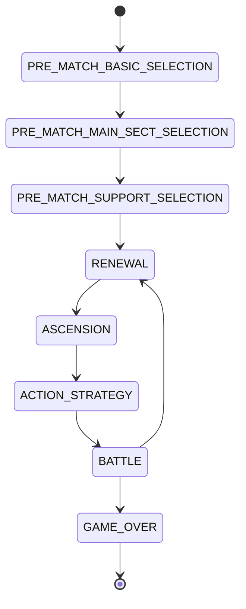

# SwordVerse API and WebSocket Contract

## 1. Purpose and Scope

This document defines the public REST and STOMP-over-WebSocket contract between the SwordVerse React client and Spring Boot server.

SwordVerse is a server-authoritative online 1v1 round-based auto-combat game. Clients submit player intent and render authoritative server responses. Clients must not calculate or submit official stats, resource changes, Action outcomes, Effect results, phase transitions, or match results.

The contract covers:

- Authentication and session renewal
- Static Sect and Action data
- Private 1v1 rooms
- Basic, Main, and Support loadout selection
- Renewal, Ascension, Action Strategy, and Battle
- Active Effects and Passive Action triggers
- Reconnection, surrender, and match results

Matchmaking, ranking, spectators, chat, replay, shops, and content versioning are outside the current scope.

---

## 2. Conventions

### 2.1 Transport

- REST payloads use JSON and UTF-8.
- Protected REST endpoints use `Authorization: Bearer <access-token>`.
- WebSocket messaging uses STOMP over WSS in production.
- Timestamps are Unix epoch milliseconds in UTC.
- Identifiers are UUID strings.
- JSON property names use `camelCase`.
- Enum values use `UPPER_SNAKE_CASE`.
- Missing optional values are represented by `null` or omitted as specified by the DTO.

### 2.2 Action terminology

The API always uses the term **Action**. An Action is the server-side gameplay entity represented as a selectable game card in the UI.

Actions are classified independently:

```text
actionSource:
- BASIC
- SECT_TECHNIQUE

activationType:
- ACTIVE
- PASSIVE

resolutionTypes for Active Actions: a non-empty array containing up to three distinct values:
- RESOLVE_ON_START
- RESOLVE_DURING_EXECUTION
- RESOLVE_ON_END
```

Each Action Effect is assigned to one of the Action's declared resolution types. `RESOLVE_ON_START` resolves at `startTick + 1`, `RESOLVE_DURING_EXECUTION` is active throughout `(startTick, endTick]`, and `RESOLVE_ON_END` resolves at `endTick`. Passive Actions use an empty `resolutionTypes` array.

An Action may additionally have:

```text
isUltimate = true
```

The English term **Ultimate** is used for `isUltimate`. The API does not use `Technique`, `Skill`, or `Card` as resource names.

### 2.3 Standard REST response

Successful REST endpoints return the resource directly. Collection endpoints return:

```json
{
  "items": [],
  "total": 0
}
```

Errors use:

```json
{
  "error": {
    "code": "ACTION_NOT_FOUND",
    "message": "The requested Action does not exist.",
    "details": {
      "actionId": "11111111-1111-1111-1111-111111111111"
    }
  }
}
```

---

## 3. Core Game Rules

### 3.1 Sect and Action selection

Each Sect owns a configured set of Actions, normally around five.

Each player selects:

1. Two distinct Basic Actions from `SLASH`, `DEFEND`, and `SHIELD`.
2. One Main Sect.
3. Three distinct Actions belonging to the Main Sect.
4. One Support Sect.
5. One Action belonging to the Support Sect.

The Support Sect may be the same as the Main Sect. The Support Action:

- Must not duplicate any selected Main Action.
- Must not be an Ultimate.
- May be active or passive.

After selection, each player has exactly six Action slots:

```text
BASIC_1
BASIC_2
MAIN_1
MAIN_2
MAIN_3
SUPPORT
```

Both selected Basic Actions start at level 1. Other Actions use:

```text
currentLevel = 0  -> locked
currentLevel >= 1 -> unlocked
```

### 3.2 Action Queue

Only unlocked Actions with `activationType = ACTIVE` are valid executable queue occurrences. Queue confirmation does not validate or reject a submitted queue; invalid occurrences become `EMPTY_SLOT` at runtime.

An active Action slot may appear multiple times in the same queue. Passive Actions cannot be queued. They activate automatically when their configured gameplay-event conditions are satisfied.

An Action Queue has no maximum number of occurrences and no maximum timeline duration. Each Action retains its configured duration, but the complete queue may use any number of ticks.

One tick is `0.1` second. Actions occupy `(startTick, endTick]`, and AS does not modify any Action's duration. `SLASH`, `DEFEND`, and `SHIELD` are Basic Actions with unlimited consecutive uses and no cooldown. Sect Techniques use their configured cooldown unchanged by AS.

Before confirming, the client may request an advisory queue check. It reports cooldown, stack, transition, ownership, level, and activation-type violations. It never checks resource sufficiency and does not confirm, lock, or block the queue.

After round 1, the player may remove zero or one contiguous range of occurrences from the previous confirmed queue. The removed duration must satisfy `removedDurationTicks * 3 <= previousConfirmedQueueDurationTicks`; retained occurrences keep their relative order, and newly selected Actions may be inserted anywhere. `previousConfirmedQueueDurationTicks` is the prior confirmed queue's total duration, not a Queue limit.

### 3.3 Runtime resources

HP has current and maximum values. Qi is global runtime state, not a character Stat; Sects do not grant it and Ascension cannot upgrade it.

```text
0 <= roundQi <= 550
0 <= reserveQi <= 150
availableQi = roundQi + reserveQi
```

`availableQi` is derived and read-only; it is not independently persisted. Action costs use `QI` and may use both pools. Before paying a QI cost, the server verifies `roundQi + reserveQi >= requiredQi`, deducts from `roundQi` first, then deducts any remainder from `reserveQi`. All Action costs are atomic: insufficient combined Qi deducts neither Qi nor any other cost and produces `INSUFFICIENT_RESOURCE` with the existing `EMPTY_SLOT` behavior.

Effects may restore or generate Qi, and every Qi-changing Effect must explicitly target `ROUND_QI` or `RESERVE_QI`. The server clamps the affected pool to `0..550` or `0..150` respectively; excess Qi is discarded and neither pool may become negative. Effects cannot modify a Qi maximum.

During Renewal, the server:

1. Resolves Effects scheduled for `RENEWAL_START`.
2. Transfers remaining Round Qi into Reserve Qi using `transferableQi = min(roundQi, 150 - reserveQi)`, then sets `reserveQi = reserveQi + transferableQi`, `discardedQi = roundQi - transferableQi`, and `roundQi = 0`.
3. Grants Round Qi for the new round: 150 in round 1, 250 in round 2, 300 in round 3, 350 in round 4, 400 in round 5, 450 in round 6, 500 in round 7, and 550 from round 8 onward.
4. Resolves Effects scheduled for `RENEWAL_END`.
5. Clamps `roundQi` and `reserveQi` to their valid ranges.
6. Removes expired Effects according to the existing Effect lifecycle.

`RENEWAL_START` Effects may change Qi before the transfer, while `RENEWAL_END` Effects observe newly granted Round Qi. Untransferable Round Qi is discarded when Reserve Qi is full.

### 3.4 Battle

Both Action Queues resolve simultaneously on the same 0.1-second timeline. Actions within one player's queue are sequential, but the two players' Action boundaries may differ. There is no initiative or alternating turn order.

Every occurrence is checked against actual runtime state. If it is invalid, cannot pay its cost, or is disabled, it becomes `EMPTY_SLOT`, produces no Effects, and keeps its scheduled interval so later Actions do not shift. The opposing timeline continues.

Passive Actions may trigger from gameplay events produced during resolution. Passive results are included in timeline resolution events; Passive Actions are never valid executable queue entries.

---

## 4. Authentication

### 4.1 Session model

The server issues:

- A short-lived signed JWT access token.
- A rotating opaque refresh token delivered only through a host-only `HttpOnly` cookie named `swordverse_refresh`.

The access token contains `userId`, `sessionId`, and `exp`. For protected requests, the server verifies the signature and expiration, then requires the referenced session to be active and not revoked.

Only refresh-token hashes are stored. The raw refresh token is never exposed to frontend JavaScript or returned in JSON. A successful refresh reads the cookie, revokes the submitted refresh token, creates a new token for the same session, and replaces the cookie. The cookie uses `Secure` in production, `SameSite=Strict`, and path `/api/auth`.

A user may own multiple active authentication sessions across browsers or devices. Authentication sessions are independent from WebSocket connections and gameplay ownership. A valid session permits authenticated access but does not by itself permit the connection to issue gameplay commands.

Logout revokes only the authenticated session used for the request. Other sessions belonging to the same user remain active unless a separate logout-all operation is introduced.

### 4.2 Authentication endpoints

#### Register

```http
POST /api/auth/register
Content-Type: application/json
```

```json
{
  "username": "hai",
  "password": "StrongPassword123!",
  "displayName": "Hai"
}
```

Response `201 Created`:

```json
{
  "accessToken": "jwt-access-token",
  "accessTokenExpiresAt": 1783770900000,
  "refreshTokenExpiresAt": 1784374800000,
  "sessionId": "3db08711-f29f-45fd-a579-2b53ec79d21e",
  "user": {
    "userId": "d6968bcb-fb39-48ff-8b6f-813132577c28",
    "username": "hai",
    "displayName": "Hai"
  }
}
```

Errors: `USERNAME_ALREADY_EXISTS`, `VALIDATION_ERROR`.

#### Login

```http
POST /api/auth/login
Content-Type: application/json
```

```json
{
  "username": "hai",
  "password": "StrongPassword123!"
}
```

Response `200 OK`: `AuthSessionResponse`, identical to the register response.

Errors: `INVALID_CREDENTIALS`, `VALIDATION_ERROR`.

#### Refresh

```http
POST /api/auth/refresh
Cookie: swordverse_refresh=<opaque-refresh-token>
```

The request has no JSON body. The browser sends the host-only `HttpOnly` refresh-token cookie automatically.

Response `200 OK`: rotated `AuthSessionResponse`.

Errors: `INVALID_TOKEN`, `TOKEN_EXPIRED`, `SESSION_REVOKED`, `TOKEN_REUSE_DETECTED`.

#### Logout

```http
POST /api/auth/logout
Authorization: Bearer <access-token>
Cookie: swordverse_refresh=<opaque-refresh-token>
```

The request has no JSON body. Logout clears the refresh-token cookie.

Response: `204 No Content`.

Logout revokes the session, revokes its active refresh tokens, and closes WebSocket connections associated with that session.

#### Current user

```http
GET /api/auth/me
Authorization: Bearer <access-token>
```

Response `200 OK`:

```json
{
  "userId": "d6968bcb-fb39-48ff-8b6f-813132577c28",
  "username": "hai",
  "displayName": "Hai"
}
```

Errors: `UNAUTHORIZED`, `TOKEN_EXPIRED`, `SESSION_REVOKED`.

---

## 5. Static Game Data APIs

Static endpoints expose display and selection data. They do not expose server-only handler keys or internal Effect component configuration.

### 5.1 List Sects

```http
GET /api/sects
Authorization: Bearer <access-token>
```

Response `200 OK`:

```json
{
  "items": [
    {
      "sectId": "fdb55783-b0d7-4f74-9ac6-6fb587783ac8",
      "sectType": "HEAVEN_SWORD",
      "name": "Heaven Sword",
      "description": "A balanced Sect focused on precise attacks.",
      "keywords": ["balanced", "precision"],
      "mainBaseStats": {
        "str": 8,
        "hp": 100,
        "def": 4,
        "as": 5
      },
      "supportBonusStats": {
        "str": 2,
        "hp": 10,
        "def": 1,
        "as": 0
      }
    }
  ],
  "total": 1
}
```

### 5.2 Get Sect details

```http
GET /api/sects/{sectId}
Authorization: Bearer <access-token>
```

Response `200 OK`:

```json
{
  "sectId": "fdb55783-b0d7-4f74-9ac6-6fb587783ac8",
  "sectType": "HEAVEN_SWORD",
  "name": "Heaven Sword",
  "description": "A balanced Sect focused on precise attacks.",
  "keywords": ["balanced", "precision"],
  "mainBaseStats": {
    "str": 8,
    "hp": 100,
    "def": 4,
    "as": 5
  },
  "supportBonusStats": {
    "str": 2,
    "hp": 10,
    "def": 1,
    "as": 0
  },
  "actions": [
    {
      "actionId": "22172357-3371-4aa7-8641-d44b9405db98",
      "actionKey": "QUICK_SLASH",
      "name": "Quick Slash",
      "description": "A fast sword strike.",
      "actionSource": "SECT_TECHNIQUE",
      "activationType": "ACTIVE",
      "resolutionTypes": ["RESOLVE_ON_END"],
      "isUltimate": false,
      "maxLevel": 3
    },
    {
      "actionId": "74fd7785-e24b-4de5-8f97-2bd990f8ab90",
      "actionKey": "HEAVENLY_EXECUTION",
      "name": "Heavenly Execution",
      "description": "The Ultimate Action of Heaven Sword.",
      "actionSource": "SECT_TECHNIQUE",
      "activationType": "ACTIVE",
      "resolutionTypes": ["RESOLVE_ON_END"],
      "isUltimate": true,
      "maxLevel": 3
    }
  ]
}
```

Errors: `SECT_NOT_FOUND`.

### 5.3 List Actions

```http
GET /api/actions?actionSource=SECT_TECHNIQUE&activationType=PASSIVE&sectId={sectId}
Authorization: Bearer <access-token>
```

All query parameters are optional.

Response `200 OK`:

```json
{
  "items": [
    {
      "actionId": "0c949f1c-5731-45f8-a7ec-e6a2618dd80e",
      "actionKey": "SWORD_INSTINCT",
      "name": "Sword Instinct",
      "description": "Triggers after three successful hits.",
      "actionSource": "SECT_TECHNIQUE",
      "activationType": "PASSIVE",
      "resolutionTypes": [],
      "isUltimate": false,
      "maxLevel": 3,
      "sectIds": ["fdb55783-b0d7-4f74-9ac6-6fb587783ac8"]
    }
  ],
  "total": 1
}
```

Errors: `INVALID_FILTER`, `SECT_NOT_FOUND`.

### 5.4 Get Action details

```http
GET /api/actions/{actionId}
Authorization: Bearer <access-token>
```

Response `200 OK`:

```json
{
  "actionId": "22172357-3371-4aa7-8641-d44b9405db98",
  "actionKey": "QUICK_SLASH",
  "name": "Quick Slash",
  "description": "A fast sword strike.",
  "actionSource": "SECT_TECHNIQUE",
  "activationType": "ACTIVE",
  "resolutionTypes": ["RESOLVE_ON_END"],
  "isUltimate": false,
  "sectIds": ["fdb55783-b0d7-4f74-9ac6-6fb587783ac8"],
  "levels": [
    {
      "level": 1,
      "learningPointCost": 1,
      "baseDurationTicks": 10,
      "baseCooldownTicks": 5,
      "maxConsecutiveStacks": 1,
      "costs": [
        {
          "resourceType": "QI",
          "paymentTiming": "ON_EXECUTION_START",
          "calculationType": "FLAT",
          "value": 8
        }
      ],
      "publicEffects": [
        {
          "name": "Deal damage",
          "description": "Deals damage to the opponent."
        }
      ]
    }
  ]
}
```

Errors: `ACTION_NOT_FOUND`.

---

## 6. Room REST APIs

### 6.1 Create room

```http
POST /api/rooms
Authorization: Bearer <access-token>
```

Response `201 Created`:

```json
{
  "roomId": "14dcc51b-a34e-4ad8-96da-e0a22f3f3503",
  "roomCode": "A7K9Q2",
  "status": "WAITING_FOR_PLAYER",
  "playerA": {
    "userId": "d6968bcb-fb39-48ff-8b6f-813132577c28",
    "username": "hai",
    "ready": false,
    "connected": false
  },
  "playerB": null
}
```

Room creation and gameplay-lease reservation occur atomically. The response reports `connected = false` until an authenticated WebSocket connection successfully claims control of the room activity.

Errors: `GAMEPLAY_ACTIVE_ON_ANOTHER_CONNECTION`.

### 6.2 Join room

```http
POST /api/rooms/join
Authorization: Bearer <access-token>
Content-Type: application/json
```

```json
{
  "roomCode": "A7K9Q2"
}
```

Response `200 OK`: complete `RoomState`.

Room membership and gameplay-lease reservation occur atomically. Realtime connection state becomes connected only after the reserved activity is claimed through WebSocket.

Errors: `ROOM_NOT_FOUND`, `ROOM_FULL`, `ROOM_ALREADY_STARTED`, `ALREADY_IN_ROOM`, `GAMEPLAY_ACTIVE_ON_ANOTHER_CONNECTION`.

### 6.3 Get room

```http
GET /api/rooms/{roomId}
Authorization: Bearer <access-token>
```

Response `200 OK`: complete `RoomState`.

This read operation does not acquire or transfer a gameplay lease.

Errors: `ROOM_NOT_FOUND`, `PLAYER_NOT_IN_ROOM`.

---

## 7. Match REST APIs

### 7.1 Get match snapshot

```http
GET /api/matches/{matchId}
Authorization: Bearer <access-token>
```

Response `200 OK`:

```json
{
  "matchId": "8262bd3a-8ad5-41b6-baf1-5e356b0ef937",
  "status": "IN_PROGRESS",
  "phase": "ACTION_STRATEGY",
  "roundNumber": 2,
  "currentTimelineTick": 0,
  "phaseStartedAt": 1783770000000,
  "phaseDeadlineAt": 1783770030000,
  "players": [
    {
      "playerId": "5ab5cf4a-dc55-4130-b8e2-5b7751b091e0",
      "userId": "d6968bcb-fb39-48ff-8b6f-813132577c28",
      "seat": "PLAYER_A",
      "connected": true,
      "mainSectId": "fdb55783-b0d7-4f74-9ac6-6fb587783ac8",
      "supportSectId": "0bdca6ea-dd91-40e9-bd81-c7fc0ba15875",
      "state": {
        "statLevels": { "str": 1, "hp": 1, "def": 1, "as": 1 },
        "str": 10,
        "def": 5,
        "as": 5,
        "hp": { "current": 92, "max": 110 },
        "qi": { "roundQi": 250, "reserveQi": 50, "roundMax": 550, "reserveMax": 150, "available": 300 }
      },
      "actionSlots": [
        {
          "actionSlotId": "863cda43-a4bf-4fd9-858a-715cc46fe982",
          "slotType": "BASIC_1",
          "actionId": "737cb9aa-f0c8-4180-a9c8-a94fe9e0de7d",
          "activationType": "ACTIVE",
          "isUltimate": false,
          "currentLevel": 1
        },
        {
          "actionSlotId": "9f9ab91b-f8ad-4c8a-8e68-f842d117ac51",
          "slotType": "BASIC_2",
          "actionId": "ca9890b7-10b4-483f-b62c-26e91f053fad",
          "activationType": "ACTIVE",
          "isUltimate": false,
          "currentLevel": 1
        },
        {
          "actionSlotId": "18a9a33b-ff9a-4519-8fbc-04f70c522c79",
          "slotType": "MAIN_1",
          "actionId": "22172357-3371-4aa7-8641-d44b9405db98",
          "activationType": "ACTIVE",
          "isUltimate": false,
          "currentLevel": 1
        },
        {
          "actionSlotId": "3e6bb0ea-bda5-4559-b8fc-559feeaedf28",
          "slotType": "MAIN_2",
          "actionId": "0c949f1c-5731-45f8-a7ec-e6a2618dd80e",
          "activationType": "PASSIVE",
          "isUltimate": false,
          "currentLevel": 1
        },
        {
          "actionSlotId": "a6e8d004-a1cb-480e-87cb-8947e2a3ac33",
          "slotType": "MAIN_3",
          "actionId": "74fd7785-e24b-4de5-8f97-2bd990f8ab90",
          "activationType": "ACTIVE",
          "isUltimate": true,
          "currentLevel": 0
        },
        {
          "actionSlotId": "310fe49f-b93b-4684-a1fe-f28588865757",
          "slotType": "SUPPORT",
          "actionId": "dc0d8d97-7a73-454f-ab90-57d16948ca15",
          "activationType": "PASSIVE",
          "isUltimate": false,
          "currentLevel": 0
        }
      ],
      "activeEffects": [],
      "ascensionConfirmed": false,
      "actionQueueConfirmed": false
    }
  ]
}
```

Secret selections, pending Ascension allocations, and unrevealed queues belonging to the opponent are omitted.

Errors: `MATCH_NOT_FOUND`, `PLAYER_NOT_IN_MATCH`.

### 7.2 Get match result

```http
GET /api/matches/{matchId}/result
Authorization: Bearer <access-token>
```

Response `200 OK`:

```json
{
  "matchId": "8262bd3a-8ad5-41b6-baf1-5e356b0ef937",
  "winnerPlayerId": "5ab5cf4a-dc55-4130-b8e2-5b7751b091e0",
  "loserPlayerId": "37f622bf-7200-4cdc-b8bf-918737abe778",
  "reason": "HP_REACHED_ZERO",
  "endedAt": 1783770101500,
  "finalPlayers": [
    {
      "playerId": "5ab5cf4a-dc55-4130-b8e2-5b7751b091e0",
      "state": {
        "hp": { "current": 18, "max": 110 },
        "qi": { "roundQi": 0, "reserveQi": 70, "roundMax": 550, "reserveMax": 150, "available": 70 }
      }
    }
  ]
}
```

For `DRAW`, `winnerPlayerId` and `loserPlayerId` are null.

Errors: `MATCH_NOT_FOUND`, `PLAYER_NOT_IN_MATCH`, `MATCH_NOT_FINISHED`.

---

## 8. WebSocket Transport

### 8.1 Connection

Endpoint:

```text
/ws
```

STOMP `CONNECT` header:

```text
Authorization: Bearer <access-token>
```

The server verifies the JWT and active session, then creates the Spring `Principal`. Handlers derive player identity exclusively from `Principal`.

Access-token expiry does not terminate an established connection. Explicit logout or session revocation closes every connection associated with that session.

A user may establish multiple general WebSocket connections. Establishing a connection does not acquire gameplay ownership and disconnecting a general connection does not revoke authentication.

### 8.2 Gameplay lease

A user may own at most one gameplay lease. The lease identifies the authenticated user, session, controlling connection, and current `MATCHMAKING`, `ROOM`, or `MATCH` activity.

Room creation and joining are currently HTTP operations. A successful operation atomically reserves the user's gameplay lease for the authenticated session. After the client connects and subscribes, it claims realtime control through:

```text
/app/gameplay/claim
```

Payload:

```json
{
  "activityType": "ROOM",
  "activityId": "14dcc51b-a34e-4ad8-96da-e0a22f3f3503"
}
```

For matchmaking, `activityId` is omitted until a room or match is assigned. For room or match reconnection, the identifier is required.

Lease acquisition, reservation, claim, transfer, and release are atomic. A connection must own the lease before sending room or match mutation commands. Authentication alone is insufficient. Snapshot requests additionally require ordinary membership authorization but may be allowed during the documented reconnect claim sequence.

If another healthy connection owns the lease, the server rejects the command with `GAMEPLAY_ACTIVE_ON_ANOTHER_CONNECTION`. This is a gameplay ownership conflict, not an authentication failure; the rejected connection remains authenticated.

### 8.3 Destinations

| Direction | Destination                                      | Purpose                                           |
| --------- | ------------------------------------------------ | ------------------------------------------------- |
| Subscribe | `/user/queue/room-events`                        | Private room results and rejections.              |
| Subscribe | `/user/queue/match-events`                       | Private match results and rejections.             |
| Subscribe | `/topic/rooms/{roomId}`                          | Public room events.                               |
| Subscribe | `/topic/matches/{matchId}`                       | Public match events.                              |
| Send      | `/app/gameplay/claim`                            | Claim a reserved or reconnectable gameplay lease. |
| Send      | `/app/rooms/{roomId}/ready`                      | Update readiness.                                 |
| Send      | `/app/rooms/{roomId}/leave`                      | Leave the room.                                   |
| Send      | `/app/rooms/{roomId}/kick`                       | Host removes Player B.                            |
| Send      | `/app/rooms/{roomId}/start`                      | Start the match.                                  |
| Send      | `/app/rooms/{roomId}/request-snapshot`           | Request private room snapshot.                    |
| Send      | `/app/matches/{matchId}/confirm-basic-loadout`   | Confirm two of the three Basic Actions.           |
| Send      | `/app/matches/{matchId}/confirm-main-loadout`    | Confirm Main Sect and three Main Actions.         |
| Send      | `/app/matches/{matchId}/confirm-support-loadout` | Confirm Support Sect and Support Action.          |
| Send      | `/app/matches/{matchId}/confirm-ascension`       | Confirm Ascension allocation.                     |
| Send      | `/app/matches/{matchId}/check-action-queue`      | Preview Action Queue validity without confirming. |
| Send      | `/app/matches/{matchId}/confirm-action-queue`    | Confirm Action Queue.                             |
| Send      | `/app/matches/{matchId}/surrender`               | Surrender.                                        |
| Send      | `/app/matches/{matchId}/request-snapshot`        | Request private match snapshot.                   |

### 8.4 Client command envelope

```json
{
  "commandId": "77e99328-7e61-4e84-aa93-73f9a8379451",
  "type": "CONFIRM_ACTION_QUEUE",
  "clientTime": 1783770000000,
  "payload": {}
}
```

`commandId` is used for in-process duplicate protection. A client must reuse the same ID only when retrying the same command.

### 8.5 Server event envelope

```json
{
  "eventId": "189a4f5c-65b6-4e84-87eb-380252f0dca9",
  "type": "TIMELINE_POINT_RESOLVED",
  "matchId": "8262bd3a-8ad5-41b6-baf1-5e356b0ef937",
  "serverTime": 1783770001500,
  "correlationId": "77e99328-7e61-4e84-aa93-73f9a8379451",
  "payload": {}
}
```

The current schema does not persist event history. On reconnect, the client subscribes and requests a fresh snapshot; it does not request event replay.

---

## 9. Room Commands and Events

### 9.1 Set readiness

Destination:

```text
/app/rooms/{roomId}/ready
```

Payload:

```json
{
  "ready": true
}
```

Success event:

```json
{
  "type": "ROOM_STATE_UPDATED",
  "roomId": "14dcc51b-a34e-4ad8-96da-e0a22f3f3503",
  "payload": {
    "room": {
      "roomId": "14dcc51b-a34e-4ad8-96da-e0a22f3f3503",
      "roomCode": "A7K9Q2",
      "status": "OPEN",
      "playerA": {
        "userId": "d6968bcb-fb39-48ff-8b6f-813132577c28",
        "username": "hai",
        "ready": true,
        "connected": true
      },
      "playerB": null
    }
  }
}
```

### 9.2 Leave room

Payload:

```json
{}
```

Events: `PLAYER_LEFT_ROOM`, followed by `ROOM_STATE_UPDATED` or `ROOM_CLOSED`.

If Player A leaves before the match starts and Player B remains, Player B is promoted to Player A by the server.

### 9.3 Kick player

Payload:

```json
{
  "targetUserId": "01c8bdf1-1ab9-48df-9faf-c4d60b1b323c"
}
```

Events: private `PLAYER_KICKED` to the removed player and public `ROOM_STATE_UPDATED`.

Errors: `NOT_ROOM_HOST`, `PLAYER_NOT_IN_ROOM`, `ROOM_ALREADY_STARTED`.

### 9.4 Start match

Payload:

```json
{}
```

Success event:

```json
{
  "type": "MATCH_CREATED",
  "roomId": "14dcc51b-a34e-4ad8-96da-e0a22f3f3503",
  "matchId": "8262bd3a-8ad5-41b6-baf1-5e356b0ef937",
  "payload": {
    "phase": "PRE_MATCH_BASIC_SELECTION"
  }
}
```

Errors: `NOT_ROOM_HOST`, `PLAYERS_NOT_READY`, `PLAYER_DISCONNECTED`.

---

## 10. Pre-Match Selection

### 10.1 Confirm Basic loadout

Destination:

```text
/app/matches/{matchId}/confirm-basic-loadout
```

Payload:

```json
{
  "basicActionIds": [
    "737cb9aa-f0c8-4180-a9c8-a94fe9e0de7d",
    "ca9890b7-10b4-483f-b62c-26e91f053fad"
  ]
}
```

Validation:

- Phase is `PRE_MATCH_BASIC_SELECTION`.
- Exactly two distinct Actions are supplied.
- Both use `actionSource = BASIC`.
- Their `actionKey` values are selected from `SLASH`, `DEFEND`, and `SHIELD`.

After both players confirm, `BASIC_LOADOUT_RESOLVED` reveals both selections, creates `BASIC_1` and `BASIC_2` at level 1, and advances to `PRE_MATCH_MAIN_SECT_SELECTION`.

Errors: `BASIC_ACTION_COUNT_INVALID`, `BASIC_ACTION_INVALID`, `DUPLICATE_ACTION`, `INVALID_MATCH_PHASE`.

### 10.2 Confirm Main loadout

Destination:

```text
/app/matches/{matchId}/confirm-main-loadout
```

Payload:

```json
{
  "mainSectId": "fdb55783-b0d7-4f74-9ac6-6fb587783ac8",
  "mainActionIds": [
    "22172357-3371-4aa7-8641-d44b9405db98",
    "0c949f1c-5731-45f8-a7ec-e6a2618dd80e",
    "74fd7785-e24b-4de5-8f97-2bd990f8ab90"
  ]
}
```

Validation:

- Phase is `PRE_MATCH_MAIN_SECT_SELECTION`.
- Sect exists.
- Exactly three distinct Actions are supplied.
- Every Action belongs to the selected Sect.
- Active, passive, and Ultimate Actions are allowed.

Before both players confirm, public event:

```json
{
  "type": "PLAYER_CONFIRMATION_CHANGED",
  "matchId": "8262bd3a-8ad5-41b6-baf1-5e356b0ef937",
  "payload": {
    "playerId": "5ab5cf4a-dc55-4130-b8e2-5b7751b091e0",
    "kind": "MAIN_LOADOUT",
    "confirmed": true
  }
}
```

The event does not reveal the selection.

After both confirm, `MAIN_LOADOUT_RESOLVED` reveals both Main Sects and Main Actions and advances to `PRE_MATCH_SUPPORT_SELECTION`.

Errors: `SECT_NOT_FOUND`, `ACTION_NOT_FOUND`, `ACTION_NOT_IN_SECT`, `MAIN_ACTION_COUNT_INVALID`, `DUPLICATE_ACTION`, `INVALID_MATCH_PHASE`.

### 10.3 Confirm Support loadout

Destination:

```text
/app/matches/{matchId}/confirm-support-loadout
```

Payload:

```json
{
  "supportSectId": "0bdca6ea-dd91-40e9-bd81-c7fc0ba15875",
  "supportActionId": "dc0d8d97-7a73-454f-ab90-57d16948ca15"
}
```

Validation:

- Phase is `PRE_MATCH_SUPPORT_SELECTION`.
- Support Sect exists and may equal the Main Sect.
- Support Action belongs to the Support Sect.
- Support Action does not duplicate a selected Main Action.
- Support Action has `isUltimate = false`.
- Active or passive Support Actions are allowed.

After both confirm, `SUPPORT_LOADOUT_RESOLVED` includes both complete six-slot loadouts:

```json
{
  "type": "SUPPORT_LOADOUT_RESOLVED",
  "matchId": "8262bd3a-8ad5-41b6-baf1-5e356b0ef937",
  "payload": {
    "phase": "RENEWAL",
    "roundNumber": 1,
    "players": [
      {
        "playerId": "5ab5cf4a-dc55-4130-b8e2-5b7751b091e0",
        "mainSectId": "fdb55783-b0d7-4f74-9ac6-6fb587783ac8",
        "supportSectId": "0bdca6ea-dd91-40e9-bd81-c7fc0ba15875",
        "actionSlots": [
          {
            "actionSlotId": "863cda43-a4bf-4fd9-858a-715cc46fe982",
            "slotType": "BASIC_1",
            "actionId": "737cb9aa-f0c8-4180-a9c8-a94fe9e0de7d",
            "activationType": "ACTIVE",
            "isUltimate": false,
            "currentLevel": 1
          },
          {
            "actionSlotId": "9f9ab91b-f8ad-4c8a-8e68-f842d117ac51",
            "slotType": "BASIC_2",
            "actionId": "ca9890b7-10b4-483f-b62c-26e91f053fad",
            "activationType": "ACTIVE",
            "isUltimate": false,
            "currentLevel": 1
          },
          {
            "actionSlotId": "18a9a33b-ff9a-4519-8fbc-04f70c522c79",
            "slotType": "MAIN_1",
            "actionId": "22172357-3371-4aa7-8641-d44b9405db98",
            "activationType": "ACTIVE",
            "isUltimate": false,
            "currentLevel": 0
          },
          {
            "actionSlotId": "3e6bb0ea-bda5-4559-b8fc-559feeaedf28",
            "slotType": "MAIN_2",
            "actionId": "0c949f1c-5731-45f8-a7ec-e6a2618dd80e",
            "activationType": "PASSIVE",
            "isUltimate": false,
            "currentLevel": 0
          },
          {
            "actionSlotId": "a6e8d004-a1cb-480e-87cb-8947e2a3ac33",
            "slotType": "MAIN_3",
            "actionId": "74fd7785-e24b-4de5-8f97-2bd990f8ab90",
            "activationType": "ACTIVE",
            "isUltimate": true,
            "currentLevel": 0
          },
          {
            "actionSlotId": "310fe49f-b93b-4684-a1fe-f28588865757",
            "slotType": "SUPPORT",
            "actionId": "dc0d8d97-7a73-454f-ab90-57d16948ca15",
            "activationType": "PASSIVE",
            "isUltimate": false,
            "currentLevel": 0
          }
        ],
        "state": {
          "statLevels": { "str": 1, "hp": 1, "def": 1, "as": 1 },
          "str": 10,
          "def": 5,
          "as": 5,
          "hp": { "current": 110, "max": 110 },
          "qi": { "roundQi": 0, "reserveQi": 0, "roundMax": 550, "reserveMax": 150, "available": 0 }
        }
      }
    ]
  }
}
```

Errors: `SUPPORT_ACTION_INVALID`, `SUPPORT_ACTION_DUPLICATES_MAIN`, `ULTIMATE_NOT_ALLOWED_AS_SUPPORT`.

---

## 11. Round Phases



Every phase event contains:

```json
{
  "phase": "ASCENSION",
  "roundNumber": 2,
  "phaseStartedAt": 1783770000000,
  "phaseDeadlineAt": 1783770030000
}
```

### 11.1 Renewal events

`RENEWAL_STARTED` contains state before Renewal.

`RENEWAL_RESOLVED` contains:

```json
{
  "type": "RENEWAL_RESOLVED",
  "matchId": "8262bd3a-8ad5-41b6-baf1-5e356b0ef937",
  "payload": {
    "roundNumber": 2,
    "resolvedEffects": [
      {
        "effectKey": "BLEED",
        "sourcePlayerId": "37f622bf-7200-4cdc-b8bf-918737abe778",
        "targetPlayerId": "5ab5cf4a-dc55-4130-b8e2-5b7751b091e0",
        "changes": [
          {
            "attribute": "HP",
            "before": 94,
            "change": -2,
            "after": 92
          }
        ]
      }
    ],
    "players": [
      {
        "playerId": "5ab5cf4a-dc55-4130-b8e2-5b7751b091e0",
        "qi": { "roundQi": 250, "reserveQi": 150, "roundMax": 550, "reserveMax": 150, "available": 400 },
        "renewalQi": {
          "roundQiTransferred": 40,
          "discardedRoundQi": 10,
          "roundQiGranted": 250,
          "effectChanges": [
            { "target": "ROUND_QI", "before": 40, "change": 10, "after": 50 }
          ]
        }
      }
    ]
  }
}
```

`roundQiTransferred` is the amount moved into Reserve Qi before the new-round grant, and `discardedRoundQi` is the amount that did not fit. `effectChanges` includes Qi changes caused by Renewal Effects. The final `qi` object is authoritative and is emitted after the Renewal order defined in section 3.3. The server then emits `ASCENSION_STARTED` with `learningPoints: 2`.

### 11.2 Confirm Ascension

Destination:

```text
/app/matches/{matchId}/confirm-ascension
```

Payload:

```json
{
  "allocations": [
    {
      "targetType": "STAT",
      "stat": "STR",
      "learningPoints": 1
    },
    {
      "targetType": "ACTION_LEVEL",
      "actionSlotId": "18a9a33b-ff9a-4519-8fbc-04f70c522c79",
      "learningPoints": 1
    }
  ]
}
```

Rules:

- Total allocation is between 0 and 2 LP.
- Stat targets are limited to `HP`, `STR`, `DEF`, and `AS`.
- Stats and Actions have a maximum level of 3.
- Each `STAT` upgrade permanently increases the selected unmodified integer Stat value by 10%. The increase is cumulative, calculated before temporary Effect modifiers, and rounded up: `increase = ceil(statValue * 0.10)`.
- For `HP`, calculate the rounded-up 10% increase from the previous maximum, add it to `hp.max`, and heal `hp.current` by that same amount without exceeding the new maximum.
- Level `0 -> 1` learns the Action.
- Level `1+` upgrades the Action.
- Unspent LP is forfeited.
- The allocation is submitted once and cannot be edited after confirmation.

At timeout, an unconfirmed player receives an empty allocation. After both confirmations or timeout, `ASCENSION_RESOLVED` publishes updated Action levels and player state.

Errors: `LEARNING_POINTS_EXCEEDED`, `INVALID_ASCENSION_TARGET`, `ACTION_LEVEL_MAX`, `ALREADY_CONFIRMED`.

### 11.3 Check Action Queue

Destination:

```text
/app/matches/{matchId}/check-action-queue
```

Payload:

```json
{
  "actionSlotIds": [
    "863cda43-a4bf-4fd9-858a-715cc46fe982",
    "18a9a33b-ff9a-4519-8fbc-04f70c522c79",
    "863cda43-a4bf-4fd9-858a-715cc46fe982"
  ]
}
```

Private response:

```json
{
  "type": "ACTION_QUEUE_CHECKED",
  "matchId": "8262bd3a-8ad5-41f8-b6af-918737abe778",
  "payload": {
    "valid": false,
    "totalDurationTicks": 34,
    "previousConfirmedQueueDurationTicks": 30,
    "removedDurationTicks": 12,
    "occurrences": [
      {
        "sequenceIndex": 0,
        "actionSlotId": "863cda43-a4bf-4fd9-858a-715cc46fe982",
        "startTick": 0,
        "endTick": 10,
        "effectiveDurationTicks": 10,
        "effectiveCooldownTicks": 1
      }
    ],
    "violations": [
      {
        "code": "QUEUE_TRANSITION_INVALID",
        "sequenceIndex": null,
        "details": { "previousConfirmedQueueDurationTicks": 30, "removedDurationTicks": 12 }
      }
    ]
  }
}
```

The check is advisory. It does not persist, confirm, lock, reject, or alter the queue. It reports every detectable non-resource violation, including `COUNTDOWN_INVALID`, `ACTION_NOT_OWNED`, `ACTION_LOCKED`, `ACTION_NOT_QUEUEABLE`, and `QUEUE_TRANSITION_INVALID`. It never checks QI, HP, or any other Action cost.

AS does not modify Action duration or cooldown. `SLASH`, `DEFEND`, and `SHIELD` have no cooldown. Sect Techniques use `baseCooldownTicks` unchanged, and every Action duration uses `baseDurationTicks` unchanged.

### 11.4 Confirm Action Queue

Destination:

```text
/app/matches/{matchId}/confirm-action-queue
```

Payload:

```json
{
  "actionSlotIds": [
    "863cda43-a4bf-4fd9-858a-715cc46fe982",
    "18a9a33b-ff9a-4519-8fbc-04f70c522c79",
    "863cda43-a4bf-4fd9-858a-715cc46fe982"
  ]
}
```

Rules:

- The server stores the submitted sequence without running queue validation.
- Invalid ownership, level, activation type, cooldown, stack, transition, or resource state does not block confirmation.
- The same slot may appear multiple times.
- Submitting confirms the queue and prevents further edits.
- At timeout, an unconfirmed player receives an empty queue.
- Every occurrence is checked at runtime. An invalid occurrence becomes `EMPTY_SLOT`, pays no costs, produces no Effects, and retains its scheduled interval.

After both confirmations or timeout, `BATTLE_STARTED` is emitted. The opponent's complete queue remains hidden.

Errors are limited to command-level failures such as `INVALID_MATCH_PHASE`, `MALFORMED_PAYLOAD`, and `ALREADY_CONFIRMED`. Queue gameplay violations are advisory check results or runtime `EMPTY_SLOT` reasons, not confirmation rejections.

---

## 12. Battle Events

### 12.1 Action started

`ACTION_STARTED` reveals an occurrence when its `(startTick, endTick]` interval begins:

```json
{
  "type": "ACTION_STARTED",
  "matchId": "8262bd3a-8ad5-41b6-baf1-5e356b0ef937",
  "payload": {
    "roundNumber": 2,
    "timelineTick": 0,
    "playerId": "5ab5cf4a-dc55-4130-b8e2-5b7751b091e0",
    "sequenceIndex": 0,
    "actionSlotId": "863cda43-a4bf-4fd9-858a-715cc46fe982",
    "actionId": "737cb9aa-f0c8-4180-a9c8-a94fe9e0de7d",
    "actionKey": "SLASH",
    "resolutionTypes": ["RESOLVE_ON_END"],
    "startTick": 0,
    "endTick": 10,
    "effectiveDurationTicks": 10,
    "effectiveCooldownTicks": 1
  }
}
```

Action duration is never AS-adjusted. Basic Actions have no cooldown; Sect Technique cooldowns use their configured values unchanged. `RESOLVE_ON_START` Effects resolve at `startTick + 1`, `RESOLVE_DURING_EXECUTION` Effects remain active for the complete `(startTick, endTick]` interval, and `RESOLVE_ON_END` Effects resolve at `endTick`.

### 12.2 Timeline point resolved

`TIMELINE_POINT_RESOLVED` contains every completion, runtime-empty occurrence, Effect expiration, charge consumption, passive trigger, and state change resolved at one timeline point:

```json
{
  "type": "TIMELINE_POINT_RESOLVED",
  "matchId": "8262bd3a-8ad5-41b6-baf1-5e356b0ef937",
  "payload": {
    "roundNumber": 2,
    "timelineTick": 10,
    "outcomes": [
      {
        "playerId": "5ab5cf4a-dc55-4130-b8e2-5b7751b091e0",
        "sequenceIndex": 0,
        "actionId": "737cb9aa-f0c8-4180-a9c8-a94fe9e0de7d",
        "status": "SUCCESS",
        "failureReason": null,
        "effects": [
          {
            "effectKey": "SLASH_DAMAGE",
            "sourcePlayerId": "5ab5cf4a-dc55-4130-b8e2-5b7751b091e0",
            "targetPlayerId": "37f622bf-7200-4cdc-b8bf-918737abe778",
            "changes": [
              { "attribute": "HP", "before": 100, "change": -2, "after": 98 }
            ]
          }
        ]
      }
    ],
    "passiveTriggers": [],
    "players": [],
    "matchResult": null
  }
}
```

Runtime-invalid occurrences use `status = EMPTY_SLOT` and one of these `failureReason` values:

```text
COUNTDOWN_INVALID
INSUFFICIENT_RESOURCE
ACTION_NOT_OWNED
ACTION_LOCKED
ACTION_NOT_QUEUEABLE
DISABLED_BY_EFFECT
QUEUE_TRANSITION_INVALID
```

An empty occurrence retains its scheduled interval, pays no cost, and produces no Effects. The server limits passive trigger depth and events per timeline point to prevent loops.

### 12.3 Round and match completion

If no terminal condition exists after both timelines complete, the server emits `ROUND_ENDED` and starts the next Renewal.

Match result reasons:

```text
HP_REACHED_ZERO
SURRENDER
DISCONNECTED
DRAW
```

When both players reach zero HP during the same tick:

```json
{
  "reason": "DRAW",
  "winnerPlayerId": null,
  "loserPlayerId": null
}
```

---

## 13. Connection and Surrender

### 13.1 Connection changes

`PLAYER_CONNECTION_CHANGED`:

```json
{
  "type": "PLAYER_CONNECTION_CHANGED",
  "matchId": "8262bd3a-8ad5-41b6-baf1-5e356b0ef937",
  "payload": {
    "playerId": "37f622bf-7200-4cdc-b8bf-918737abe778",
    "connected": false,
    "disconnectedAt": 1783770000000,
    "disconnectDeadlineAt": 1783770300000
  }
}
```

A disconnected match player has five minutes to reconnect in any phase. Reconnection must use an active session belonging to the same user. If the deadline expires, the server ends the match with `DISCONNECTED`.

The gameplay lease remains reserved during this five-minute interval. A reconnecting client must subscribe before claiming the lease and requesting a fresh authoritative snapshot. A healthy controlling connection cannot be replaced implicitly.

### 13.2 Surrender

Destination:

```text
/app/matches/{matchId}/surrender
```

Payload:

```json
{}
```

Surrender is valid in every match phase except `GAME_OVER`. It immediately creates the match result, cancels pending timers, and emits `MATCH_ENDED`.

---

## 14. Error Codes

| Code                              | Meaning                                                                                                          |
| --------------------------------- | ---------------------------------------------------------------------------------------------------------------- |
| `UNAUTHORIZED`                    | Authentication is missing or invalid.                                                                            |
| `TOKEN_EXPIRED`                   | Access or refresh token has expired.                                                                             |
| `INVALID_TOKEN`                   | Token signature or value is invalid.                                                                             |
| `SESSION_REVOKED`                 | Server-side session is no longer active.                                                                         |
| `TOKEN_REUSE_DETECTED`            | A rotated refresh token was reused.                                                                              |
| `GAMEPLAY_LEASE_REQUIRED`         | The connection attempted a gameplay command without owning the required gameplay lease.                          |
| `GAMEPLAY_ACTIVE_ON_ANOTHER_CONNECTION` | Another connection currently owns the user's gameplay lease.                                              |
| `GAMEPLAY_CONNECTION_REPLACED`    | The connection previously owned gameplay control but an explicit transfer replaced it.                           |
| `VALIDATION_ERROR`                | Request shape or field value is invalid.                                                                         |
| `ROOM_NOT_FOUND`                  | Room does not exist.                                                                                             |
| `ROOM_FULL`                       | Both room slots are occupied.                                                                                    |
| `ROOM_ALREADY_STARTED`            | Room can no longer be changed or joined.                                                                         |
| `PLAYER_NOT_IN_ROOM`              | Caller is not a room member.                                                                                     |
| `NOT_ROOM_HOST`                   | Caller is not Player A.                                                                                          |
| `PLAYERS_NOT_READY`               | Match start requirements are not satisfied.                                                                      |
| `PLAYER_DISCONNECTED`             | Both players must be connected to start.                                                                         |
| `MATCH_NOT_FOUND`                 | Match does not exist.                                                                                            |
| `PLAYER_NOT_IN_MATCH`             | Caller is not a match player.                                                                                    |
| `INVALID_MATCH_PHASE`             | Command is not valid in the current phase.                                                                       |
| `MALFORMED_PAYLOAD`               | Command payload does not match its typed DTO.                                                                    |
| `SECT_NOT_FOUND`                  | Sect does not exist.                                                                                             |
| `ACTION_NOT_FOUND`                | Action does not exist.                                                                                           |
| `ACTION_NOT_IN_SECT`              | Action does not belong to the selected Sect.                                                                     |
| `BASIC_ACTION_COUNT_INVALID`      | Basic loadout does not contain exactly two Actions.                                                              |
| `BASIC_ACTION_INVALID`            | Basic selection contains an Action outside Slash, Defend, and Shield.                                            |
| `MAIN_ACTION_COUNT_INVALID`       | Main loadout does not contain exactly three Actions.                                                             |
| `DUPLICATE_ACTION`                | A loadout contains the same Action more than once.                                                               |
| `SUPPORT_ACTION_INVALID`          | Support Action is not eligible.                                                                                  |
| `SUPPORT_ACTION_DUPLICATES_MAIN`  | Support Action duplicates a selected Main Action.                                                                |
| `ULTIMATE_NOT_ALLOWED_AS_SUPPORT` | Ultimate Actions cannot be selected as Support.                                                                  |
| `LEARNING_POINTS_EXCEEDED`        | Ascension allocation exceeds 2 LP.                                                                               |
| `INVALID_ASCENSION_TARGET`        | Ascension target is invalid or ineligible.                                                                       |
| `ACTION_LEVEL_MAX`                | Action cannot be upgraded further.                                                                               |
| `STAT_LEVEL_MAX`                  | Upgradeable Stat is already level 3.                                                                             |
| `COUNTDOWN_INVALID`               | Advisory/runtime result: cooldown or consecutive-stack timing is invalid.                                        |
| `INSUFFICIENT_RESOURCE`           | Runtime result: actual resources cannot pay the Action cost. This is never returned by queue preview validation. |
| `ACTION_NOT_OWNED`                | Advisory/runtime result: Action slot does not belong to the caller.                                              |
| `ACTION_LOCKED`                   | Advisory/runtime result: Action has level 0.                                                                     |
| `ACTION_NOT_QUEUEABLE`            | Advisory/runtime result: submitted Action is not Active.                                                         |
| `QUEUE_TRANSITION_INVALID`        | Advisory/runtime result: previous-queue removal or retained-order rule is violated.                              |
| `ALREADY_CONFIRMED`               | Player already confirmed the phase.                                                                              |
| `MATCH_NOT_FINISHED`              | Match result is not available.                                                                                   |
| `INTERNAL_GAMEPLAY_ERROR`         | Authoritative engine could not safely resolve gameplay.                                                          |

Private STOMP rejection:

```json
{
  "type": "COMMAND_REJECTED",
  "matchId": "8262bd3a-8ad5-41b6-baf1-5e356b0ef937",
  "correlationId": "77e99328-7e61-4e84-aa93-73f9a8379451",
  "payload": {
    "code": "INVALID_MATCH_PHASE",
    "message": "The command is not valid in the current match phase.",
    "details": {}
  }
}
```

---

## 15. TypeScript DTO Reference

```ts
export type ActionSource = "BASIC" | "SECT_TECHNIQUE";
export type ActivationType = "ACTIVE" | "PASSIVE";
export type ResolutionType =
  | "RESOLVE_ON_START"
  | "RESOLVE_DURING_EXECUTION"
  | "RESOLVE_ON_END";
export type ActionSlotType =
  | "BASIC_1"
  | "BASIC_2"
  | "MAIN_1"
  | "MAIN_2"
  | "MAIN_3"
  | "SUPPORT";

export type MatchPhase =
  | "PRE_MATCH_BASIC_SELECTION"
  | "PRE_MATCH_MAIN_SECT_SELECTION"
  | "PRE_MATCH_SUPPORT_SELECTION"
  | "RENEWAL"
  | "ASCENSION"
  | "ACTION_STRATEGY"
  | "BATTLE"
  | "GAME_OVER";

export type GameplayActivityType = "MATCHMAKING" | "ROOM" | "MATCH";

export interface ClaimGameplayPayload {
  activityType: GameplayActivityType;
  activityId?: string;
}

export interface CappedValue {
  current: number;
  max: number;
}

export interface QiState {
  roundQi: number;
  reserveQi: number;
  roundMax: 550;
  reserveMax: 150;
  available: number;
}

export interface PlayerState {
  statLevels: { str: number; hp: number; def: number; as: number };
  str: number;
  def: number;
  as: number;
  hp: CappedValue;
  qi: QiState;
}

export interface ActionSummary {
  actionId: string;
  actionKey: string;
  name: string;
  description: string | null;
  actionSource: ActionSource;
  activationType: ActivationType;
  resolutionTypes: ResolutionType[];
  isUltimate: boolean;
  maxLevel: number;
}

export interface ActionLevelDefinition {
  level: 1 | 2 | 3;
  learningPointCost: number;
  baseDurationTicks: number | null;
  baseCooldownTicks: number | null;
  maxConsecutiveStacks: number | null;
}

export interface MatchActionSlot {
  actionSlotId: string;
  slotType: ActionSlotType;
  actionId: string;
  activationType: ActivationType;
  isUltimate: boolean;
  currentLevel: number;
}

export interface ConfirmBasicLoadoutPayload {
  basicActionIds: [string, string];
}

export interface ConfirmMainLoadoutPayload {
  mainSectId: string;
  mainActionIds: [string, string, string];
}

export interface ConfirmSupportLoadoutPayload {
  supportSectId: string;
  supportActionId: string;
}

export interface ConfirmActionQueuePayload {
  actionSlotIds: string[];
}

export type CheckActionQueuePayload = ConfirmActionQueuePayload;

export type QueueViolationCode =
  | "COUNTDOWN_INVALID"
  | "ACTION_NOT_OWNED"
  | "ACTION_LOCKED"
  | "ACTION_NOT_QUEUEABLE"
  | "QUEUE_TRANSITION_INVALID";

export interface QueueViolation {
  code: QueueViolationCode;
  sequenceIndex: number | null;
  details: Record<string, unknown>;
}

export interface ActionQueueCheckResult {
  valid: boolean;
  totalDurationTicks: number;
  previousConfirmedQueueDurationTicks: number | null;
  removedDurationTicks: number;
  violations: QueueViolation[];
}

export interface ClientCommand<TPayload> {
  commandId: string;
  type: string;
  clientTime: number;
  payload: TPayload;
}

export interface ServerEvent<TPayload> {
  eventId: string;
  type: string;
  roomId?: string;
  matchId?: string;
  serverTime: number;
  correlationId?: string;
  payload: TPayload;
}
```

---

## 16. Spring Boot DTO Reference

```java
public enum ActionSource {
    BASIC, SECT_TECHNIQUE
}

public enum ActivationType {
    ACTIVE, PASSIVE
}

public enum ResolutionType {
    RESOLVE_ON_START, RESOLVE_DURING_EXECUTION, RESOLVE_ON_END
}

public enum ActionSlotType {
    BASIC_1, BASIC_2, MAIN_1, MAIN_2, MAIN_3, SUPPORT
}

public enum GameplayActivityType {
    MATCHMAKING, ROOM, MATCH
}

public record QiState(
    int roundQi,
    int reserveQi,
    int roundMax,
    int reserveMax,
    int available
) {}

public record PlayerState(
    Map<String, Integer> statLevels,
    int str,
    int def,
    int as,
    CappedValue hp,
    QiState qi
) {}

public record ClaimGameplayPayload(
    GameplayActivityType activityType,
    UUID activityId
) {}

public record ConfirmBasicLoadoutPayload(
    List<UUID> basicActionIds
) {}

public record ConfirmMainLoadoutPayload(
    UUID mainSectId,
    List<UUID> mainActionIds
) {}

public record ConfirmSupportLoadoutPayload(
    UUID supportSectId,
    UUID supportActionId
) {}

public record ConfirmActionQueuePayload(
    List<UUID> actionSlotIds
) {}

public record CheckActionQueuePayload(
    List<UUID> actionSlotIds
) {}

public enum QueueViolationCode {
    COUNTDOWN_INVALID,
    ACTION_NOT_OWNED,
    ACTION_LOCKED,
    ACTION_NOT_QUEUEABLE,
    QUEUE_TRANSITION_INVALID
}

public record QueueViolation(
    QueueViolationCode code,
    Integer sequenceIndex,
    Map<String, Object> details
) {}

public record ActionQueueCheckResult(
    boolean valid,
    int totalDurationTicks,
    Integer previousConfirmedQueueDurationTicks,
    int removedDurationTicks,
    List<QueueViolation> violations
) {}

public record ClientCommand<T>(
    UUID commandId,
    String type,
    long clientTime,
    T payload
) {}

public record ServerEvent<T>(
    UUID eventId,
    String type,
    UUID roomId,
    UUID matchId,
    long serverTime,
    UUID correlationId,
    T payload
) {}
```

Java validation must use typed DTOs and enums. WebSocket handlers obtain the authenticated user from `Principal`; command payloads never contain a caller-controlled `playerId`.

---

## 17. Security and Client-State Rules

- Derive identity exclusively from JWT, active server session, and Spring `Principal`.
- Permit multiple active authentication sessions and general realtime connections for one user.
- Require an atomically acquired gameplay lease for matchmaking, room, and match mutation commands.
- Bind gameplay control to the authenticated `userId`, `sessionId`, and transport `connectionId`; do not accept caller-controlled identity fields as proof of ownership.
- Treat gameplay lease conflicts as authorization or domain conflicts, not authentication failures. They must not revoke the caller's session.
- Authorize every room and match read, subscription, and command against membership.
- Do not reveal secret Basic, Main, or Support selections, Ascension allocations, or queues before their reveal point.
- Do not expose `behavior_handler`, Effect component config, formulas, or server-only trigger filters.
- Treat every client stat, cost, target, damage, Effect, and result value as untrusted.
- Enforce loadout membership, Support duplication, and Ultimate restrictions server-side. Queue checks are advisory; queue occurrences are authoritatively checked against ownership, current level, activation type, timing, cooldown, stack, and resources at runtime.
- Process each gameplay command transactionally.
- On reconnect, subscribe before requesting a snapshot.
- Do not replay confirmation commands automatically after reconnect.
- Do not persist or expose a complete Battle replay. The frontend may render a lightweight Battle Log from live `ACTION_STARTED` and `TIMELINE_POINT_RESOLVED` events.
- Static Action and Effect definitions are immutable while matches are active. End or cancel active matches before applying static game-data changes.
