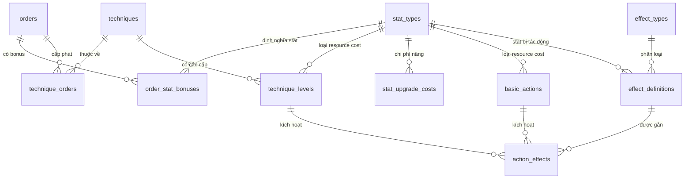
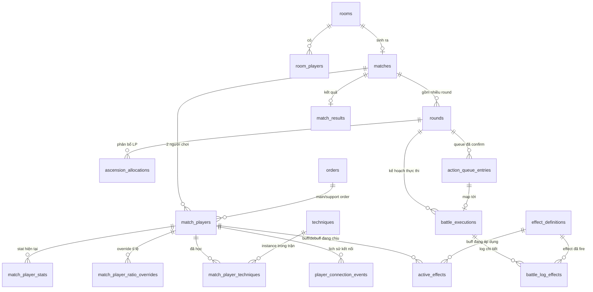

# SwordVerse — Database Schema Design

## Nguyên tắc thiết kế

Ba nguyên tắc xuyên suốt để đảm bảo mở rộng được trong tương lai mà **không cần migration** cho từng thẻ bài / hiệu ứng mới:

1. **Tách "Game Design Data" (tĩnh) khỏi "Match Runtime Data" (động).** Order, Technique, Effect là dữ liệu do dev cấu hình; Match, Round, Battle Log là dữ liệu sinh ra khi chơi. Hai nhóm không lẫn vào nhau để việc balance/thêm nội dung mới không đụng vào dữ liệu trận đấu đang chạy.
2. **Chuẩn hoá Stat thành bảng tra cứu (`stat_types`) thay vì cột cứng.** STR/HP/DEF/AS/MP/QP hiện tại là 6 giá trị cố định, nhưng thay vì hardcode 6 cột trong mọi bảng liên quan, mọi chỗ tham chiếu tới "stat nào" đều trỏ qua `stat_type_id`. Muốn thêm stat mới (ví dụ Crit Rate) sau này chỉ cần **insert 1 dòng**, không cần `ALTER TABLE` ở bất kỳ đâu.
3. **Hệ thống Effect kiểu data-driven (giống rules engine).** Đây là phần quan trọng nhất theo yêu cầu của bạn: một Technique có thể vừa gây damage, vừa hồi MP, vừa đổi tỉ lệ MP→QP, vừa áp debuff — cùng lúc. Thay vì mỗi loại tác động là một cột riêng, `effect_definitions` là một bảng tổng quát mô tả "loại tác động + mục tiêu + độ lớn + thời lượng", và một Technique/Basic Action có thể gắn **nhiều** effect theo thứ tự. Thêm một hiệu ứng mới (miễn cùng effect_type đã có engine xử lý) chỉ là insert dữ liệu, không sửa schema.

---

## Nhóm 1 — Static / Game Design Data

### `stat_types`
| Cột | Kiểu | Ý nghĩa |
|---|---|---|
| `id` | PK | |
| `code` | varchar unique | `STR`, `HP`, `DEF`, `AS`, `MP`, `QP`, và các stat tương lai |
| `name` | varchar | Tên hiển thị |
| `is_resource` | boolean | Phân biệt "stat chiến đấu" (STR/DEF/AS) với "tài nguyên tiêu hao" (MP/QP) — engine cần biết cái nào bị trừ khi dùng Action |

**Lý do tồn tại:** đây là điểm neo cho toàn bộ hệ thống mở rộng. Mọi bảng khác không lưu `str_bonus`, `hp_bonus`... như cột riêng mà lưu `(stat_type_id, value)`.

### `orders`
| Cột | Kiểu | Ý nghĩa |
|---|---|---|
| `id` | PK | |
| `code` | varchar unique | slug, vd `heaven-sword-order` |
| `name`, `description` | varchar/text | |
| `mp_to_qp_ratio` | decimal | Tỉ lệ quy đổi **mặc định** của Order. Đây chỉ là baseline — tỉ lệ thực tế tại một thời điểm trong trận có thể bị override bởi hiệu ứng (xem `match_player_ratio_overrides` ở nhóm runtime) |
| `version` | int | Đánh version để lịch sử balance patch không ghi đè dữ liệu cũ |

### `order_stat_bonuses`
| Cột | Ý nghĩa |
|---|---|
| `order_id` (FK) | |
| `stat_type_id` (FK) | |
| `bonus_value` | Lượng cộng thêm cho stat đó |

**Lý do tách bảng riêng:** thay vì 6 cột `str_bonus, hp_bonus,...` trên `orders`, dùng bảng con (order_id, stat_type_id, value) — thêm stat mới không đổi schema `orders`.

### `techniques`
| Cột | Ý nghĩa |
|---|---|
| `id`, `code`, `name`, `description` | |
| `max_level` | Giới hạn cấp độ (README: mỗi Technique có `maxLevel`) |

### `technique_orders` (bảng nối N–N)
| Cột | Ý nghĩa |
|---|---|
| `technique_id` (FK) | |
| `order_id` (FK) | |

**Lý do:** contract hiện tại (`sourceOrderIds`) cho thấy một Technique có thể thuộc **nhiều** Order — không phải 1–N. Bảng nối N–N phản ánh đúng điều này, đồng thời hỗ trợ trực tiếp quyết định "Support Order được phép trùng Main Order, nhưng Support Technique không được trùng Technique đã có từ Main Order" — chỉ cần query `technique_orders` theo `main_order_id` để lấy danh sách Technique bị cấm chọn lại.

### `technique_levels`
| Cột | Ý nghĩa |
|---|---|
| `id` | PK |
| `technique_id` (FK) | |
| `level` | 1..max_level |
| `resource_type_id` (FK stat_types, chỉ MP/QP) | Loại tài nguyên bị trừ khi **sử dụng** Technique ở level này |
| `resource_cost` | Số lượng tài nguyên bị trừ |
| `learning_point_cost` | **Số LP cần để học/lên cấp level này** |

**Lý do tồn tại — giải quyết trực tiếp gap #1 đã chốt:** đây chính là `levelUpCost` bạn yêu cầu thêm vào static data. Vì cost được lưu **theo từng level** (không phải 1 giá trị cố định trên Technique), một Technique hoàn toàn có thể có chi phí LP tăng dần theo cấp (level 1 = 1 LP, level 2 = 2 LP...) mà không cần đổi schema.

### `stat_upgrade_costs`
| Cột | Ý nghĩa |
|---|---|
| `id` | PK |
| `stat_type_id` (FK) | Stat nào |
| `tier` (nullable int) | Cho phép chi phí LP tăng theo bậc (vd 5 điểm đầu giá khác 5 điểm sau), mặc định 1 tier nếu chưa cần |
| `learning_point_cost` | LP cần cho 1 điểm nâng ở tier đó |

**Lý do tồn tại:** đây là `statUpgradeCost` đã chốt — tách riêng khỏi Order vì chi phí nâng stat có thể là quy tắc chung toàn game (không phụ thuộc Order), hoặc nếu sau này bạn muốn chi phí khác nhau theo Order, chỉ cần thêm `order_id` nullable vào bảng này mà không ảnh hưởng bảng khác.

### `basic_actions`
| Cột | Ý nghĩa |
|---|---|
| `id`, `code`, `name`, `description` | |
| `resource_type_id` (nullable FK) | Basic Action có thể có cost (để đồng nhất engine) hoặc null nếu miễn phí |
| `resource_cost` (nullable) | |

### `effect_definitions` — **lõi của khả năng mở rộng**
| Cột | Ý nghĩa |
|---|---|
| `id` | PK |
| `code` | slug, vd `damage-flat`, `apply-bleed`, `gain-mp`, `modify-mp-qp-ratio` |
| `effect_type` (FK → `effect_types` lookup, không dùng ENUM cứng) | `DAMAGE`, `HEAL`, `RESOURCE_GAIN`, `RESOURCE_DRAIN`, `STAT_MODIFIER`, `RATIO_MODIFIER`, `STATUS_APPLY`, `STATUS_REMOVE`,... |
| `target` | `SELF` / `OPPONENT` / `BOTH` |
| `stat_type_id` (nullable FK) | Dùng khi effect_type liên quan tới 1 stat/resource cụ thể (STAT_MODIFIER, RESOURCE_GAIN, RATIO_MODIFIER) |
| `magnitude` (nullable decimal) | Giá trị tuyệt đối |
| `magnitude_percent` (nullable decimal) | Giá trị theo %, cho các hiệu ứng kiểu "+10% DEF" |
| `duration_rounds` (nullable int) | `null`/0 = tức thời, >0 = hiệu ứng kéo dài, được resolve ở RENEWAL |
| `trigger` | `ON_RESOLVE`, `ON_RENEWAL`, `ON_ROUND_START`,... — thời điểm hiệu ứng kích hoạt |
| `params` (JSONB, nullable) | "Cửa thoát hiểm" — mọi tham số đặc thù chưa lường trước (điều kiện phức tạp, hiệu ứng dây chuyền, stacking rule...) mà không cần thêm cột mới |

**Lý do dùng `effect_types` là bảng tra cứu thay vì ENUM DB cứng:** ENUM trong Postgres/MySQL khi thêm giá trị mới cần migration; bảng tra cứu chỉ cần insert. Đây là bảng cho phép một Technique tương lai "vừa gây damage, vừa hồi MP, vừa đổi tỉ lệ MP-QP" — chỉ là 3 dòng khác nhau trong `effect_definitions`, gắn vào cùng 1 `technique_level` qua bảng nối bên dưới.

### `action_effects` (bảng nối: 1 Action có thể kích hoạt nhiều Effect, theo thứ tự)
| Cột | Ý nghĩa |
|---|---|
| `id` | PK |
| `technique_level_id` (nullable FK) | Đúng 1 trong 2 cột này được set (CHECK constraint) |
| `basic_action_id` (nullable FK) | |
| `effect_definition_id` (FK) | |
| `sequence_order` | Thứ tự resolve nếu Action có nhiều effect (vd: gây damage trước, rồi mới apply debuff) |
| `condition` (JSONB, nullable) | Điều kiện kích hoạt effect này (vd "chỉ áp dụng nếu HP đối thủ < 30%") |

**Lý do:** tách rời "Action nào" khỏi "Effect gì" giúp một Effect (vd `apply-bleed`) được tái sử dụng ở nhiều Technique khác nhau, và một Technique có thể có nhiều Effect xếp theo `sequence_order` — chính là yêu cầu "thẻ bài impact nhiều thứ" của bạn.

---

## Nhóm 2 — Runtime / Match Data

### `users`, `refresh_tokens`
Bảng auth tiêu chuẩn — không phải trọng tâm, giữ tối giản (`id`, `username`, `password_hash`,...).

### `rooms`
| Cột | Ý nghĩa |
|---|---|
| `id`, `room_code` (unique) | |
| `host_user_id` (FK) | |
| `status` | `WAITING_FOR_PLAYER` / `OPEN` / `IN_MATCH` / `CLOSED` |
| `room_version` | Bộ đếm cho optimistic concurrency — khớp `roomVersion` trong contract |

### `room_players`
| Cột | Ý nghĩa |
|---|---|
| `room_id`, `user_id` (FK) | |
| `ready` (boolean) | |
| `connected` (boolean) | Phục vụ trực tiếp quyết định "không cho START_MATCH nếu có người mất kết nối" |

### `matches`
| Cột | Ý nghĩa |
|---|---|
| `id`, `room_id` (FK) | |
| `match_version` | Optimistic concurrency counter |
| `phase` | ENUM các phase trong contract |
| `current_round_number` | |
| `phase_started_at`, `phase_deadline_at` | Phục vụ cơ chế timeout đã chốt |
| `initiative_player_id` (FK match_players) | Ai đi trước ở round hiện tại — cần lưu vì initiative **luân phiên theo round**, không cố định |

### `match_players`
| Cột | Ý nghĩa |
|---|---|
| `id`, `match_id`, `user_id` (FK) | |
| `seat` | `PLAYER_A` / `PLAYER_B` — vị trí cố định trong trận, dùng để tính luân phiên initiative (A lead round lẻ, B lead round chẵn) |
| `main_order_id`, `support_order_id`, `support_technique_id` (nullable FK) | Set dần theo pha chọn Order |
| `connected` (boolean), `disconnected_at` (nullable) | Phục vụ đếm ngược 5 phút áp dụng **mọi phase sau MATCH_CREATED** đã chốt |

### `match_player_stats`
| Cột | Ý nghĩa |
|---|---|
| `match_player_id` (FK) | |
| `stat_type_id` (FK) | |
| `current_value` | Giá trị stat hiện tại, đây là **state chiến đấu chính** được đọc/ghi mỗi lần resolve Action |

Composite unique `(match_player_id, stat_type_id)`.

**Lý do chuẩn hoá thay vì 6 cột (str, hp, def, as, mp, qp) trên `match_players`:** thêm stat mới trong tương lai (vd Crit) không cần `ALTER TABLE match_players`, chỉ cần thêm dòng `stat_types` và các dòng `match_player_stats` tương ứng. Đánh đổi là JOIN nhiều hơn khi đọc full state — có thể bù bằng cache JSONB snapshot trên `match_players` nếu cần tối ưu đọc (tuỳ chọn, không bắt buộc).

### `match_player_ratio_overrides`
| Cột | Ý nghĩa |
|---|---|
| `id`, `match_player_id` (FK) | |
| `ratio` | Tỉ lệ MP→QP hiện hành, override giá trị mặc định của Order |
| `source_effect_instance_id` (nullable FK `active_effects`) | Biết override này đến từ hiệu ứng nào (phục vụ log/tooltip) |
| `effective_from_round`, `effective_until_round` (nullable) | Phạm vi hiệu lực |

**Lý do:** đây là bảng giải quyết trực tiếp yêu cầu "thẻ bài thay đổi tỉ lệ quy đổi MP-QP". Ở phase RENEWAL, engine đọc override đang active của player (nếu có), nếu không có thì fallback về `orders.mp_to_qp_ratio`.

### `match_player_techniques`
| Cột | Ý nghĩa |
|---|---|
| `id`, `match_player_id`, `technique_id` (FK) | |
| `current_level` | Cấp hiện tại **trong trận này** (reset mỗi trận, không phải progression toàn cục) |
| `source` | `SUPPORT_LOADOUT` / `MAIN_ORDER` / `ASCENSION_LEARNED` — biết Technique đến từ đâu, phục vụ rule "Support Technique không trùng Technique đã có từ Main Order" |

### `rounds`
| Cột | Ý nghĩa |
|---|---|
| `id`, `match_id` (FK) | |
| `round_number` | |
| `initiative_player_id` (FK) | Snapshot ai lead round này (dù `matches.initiative_player_id` có thể đổi ở round sau, bảng này giữ lịch sử) |
| `action_queue_size` | Snapshot kích thước queue bắt buộc của round này — tách khỏi công thức cứng để sau này đổi bảng size (README) không làm sai lịch sử các trận cũ |

### `ascension_allocations`
| Cột | Ý nghĩa |
|---|---|
| `id`, `round_id`, `match_player_id` (FK) | |
| `target_type` | `STAT` / `LEARN_TECHNIQUE` / `TECHNIQUE_LEVEL` |
| `stat_type_id` (nullable FK) | |
| `technique_id` (nullable FK) | |
| `learning_points_spent` | |
| `locked_by_timeout` (boolean) | **True nếu allocation này bị khoá do hết `phaseDeadlineAt` mà không confirm** — theo quyết định "timeout = auto confirm trạng thái hiện tại" |
| `confirmed_at` (nullable) | |

**Lý do có `locked_by_timeout`:** không chỉ phục vụ logic game, mà còn cho phép sau này phân tích hành vi AFK, hoặc làm cơ sở cho anti-cheat/matchmaking penalty nếu bạn muốn mở rộng.

### `action_queue_entries`
| Cột | Ý nghĩa |
|---|---|
| `id`, `round_id`, `match_player_id` (FK) | |
| `slot_index` | Vị trí 0-based trong queue |
| `action_ref_type` | `BASIC_ACTION` / `TECHNIQUE` |
| `basic_action_id`, `technique_id` (nullable FK, đúng 1 được set) | |
| `locked_by_timeout` (boolean) | |
| `confirmed_at` (nullable) | |

**Lý do không có ràng buộc unique trên `(round_id, match_player_id, action_id)`:** đây chính là cách schema hỗ trợ "Action được phép lặp lại nhiều lần trong Queue" đã chốt — mỗi lần queue cùng 1 Action là 1 dòng riêng với `slot_index` khác nhau. Ô trống (do timeout không đủ số lượng) đơn giản là **không có dòng** cho `slot_index` đó — đúng với quyết định "không auto-fill".

### `battle_executions`
| Cột | Ý nghĩa |
|---|---|
| `id`, `round_id` (FK) | |
| `execution_index` | Thứ tự resolve trong round theo cơ chế ping-pong |
| `match_player_id` (FK) | Lượt của ai |
| `action_queue_entry_id` (nullable FK) | Null nếu slot trống (auto-fail do timeout) |
| `status` | `PENDING` / `SUCCESS` / `FAILED` |
| `failure_reason` (nullable) | `INSUFFICIENT_RESOURCE` / `DISABLED_BY_EFFECT` / `EMPTY_SLOT` |
| `revealed_at`, `resolved_at` | |

**Lý do tồn tại bảng này riêng biệt:** đây là "hidden execution plan" được vật liệu hoá (materialize) **một lần** ngay khi cả 2 Action Queue được khoá (confirm hoặc timeout-lock). `ACTION_REVEALED`/`ACTION_RESOLVED` sau đó chỉ là đọc + publish từ bảng này, không tính toán lại — vừa đúng nguyên tắc server-authoritative, vừa cho phép replay/audit trận đấu sau này.

### `battle_log_effects`
| Cột | Ý nghĩa |
|---|---|
| `id`, `battle_execution_id` (FK) | |
| `effect_definition_id` (FK) | Effect nào đã fire |
| `target_match_player_id` (FK) | Người chịu tác động (bản thân hoặc đối thủ) |
| `applied_value` | Giá trị thực tế đã áp dụng (sau khi trừ DEF, cộng buff,...) |
| `resulting_stat_type_id` (nullable FK) | Stat nào bị thay đổi, nếu có |

**Lý do:** thay vì 1 dòng "damage: 18" cứng như hiện tại, bảng này log **từng effect** riêng lẻ của 1 lần resolve Action — đúng yêu cầu "1 Technique có thể vừa gây damage vừa hồi MP vừa apply debuff" thì cả 3 dòng đều được ghi log độc lập, đầy đủ cho Battle Log hiển thị chi tiết.

### `active_effects`
| Cột | Ý nghĩa |
|---|---|
| `id`, `match_player_id` (FK) | Ai đang chịu hiệu ứng |
| `effect_definition_id` (FK) | |
| `source_battle_execution_id` (nullable FK) | Nguồn gốc, phục vụ log/tooltip |
| `remaining_rounds` | |
| `applied_at_round` | |

**Lý do:** RENEWAL phase (README 4.1) đọc bảng này để resolve toàn bộ hiệu ứng đang tồn tại trước khi quy đổi MP→QP — đây là nơi buff/debuff kéo dài nhiều round được track.

### `player_connection_events`
| Cột | Ý nghĩa |
|---|---|
| `id`, `match_player_id` (FK) | |
| `connected` (boolean) | |
| `occurred_at` | |

**Lý do log dạng append-only thay vì chỉ 1 cờ boolean:** vừa hỗ trợ tính thời gian disconnect chính xác (đếm ngược 5 phút áp dụng mọi phase), vừa để lại lịch sử phục vụ debug/khiếu nại tranh chấp sau này.

### `match_results`
| Cột | Ý nghĩa |
|---|---|
| `id`, `match_id` (FK unique) | |
| `winner_match_player_id`, `loser_match_player_id` (FK) | |
| `reason` | `HP_REACHED_ZERO` / `SURRENDER` / `DISCONNECTED` |
| `ended_at` | |

---

## Sơ đồ quan hệ

### Nhóm Static (Game Design Data)

### Nhóm Runtime (Match Data)

---

## Tóm tắt: schema giải quyết 7 điểm đã chốt như thế nào

| Điểm đã chốt | Bảng chịu trách nhiệm |
|---|---|
| 1. Metadata LP (`statUpgradeCost`, `levelUpCost`) | `technique_levels.learning_point_cost`, `stat_upgrade_costs` |
| 2. Timeout = khoá trạng thái hiện tại, không auto-fill | `locked_by_timeout` trên `ascension_allocations` và `action_queue_entries`; slot trống = không có dòng |
| 3. Disconnect 5 phút áp dụng mọi phase | `match_players.disconnected_at` + `player_connection_events`, không ràng buộc theo `phase` |
| 4. Host kick / player out / chặn start khi mất kết nối | `room_players.connected`, logic validate ở `START_MATCH` |
| 5. Refresh JWT không ảnh hưởng WS đang mở | Không cần bảng — đây là hành vi tầng application, không phải dữ liệu |
| 6. Support Order trùng Main Order được phép, Technique thì không | `technique_orders` (N–N) cho phép query technique đã có từ Main Order |
| 6. Action lặp lại trong Queue | `action_queue_entries.slot_index` không unique theo action |
| 7. Surrender hợp lệ mọi phase trừ GAME_OVER | `match_results.reason = SURRENDER`, không ràng buộc theo `phase` ở tầng DB (validate ở service layer) |
| Mở rộng: nhiều effect/1 thẻ (damage + hồi MP + đổi tỉ lệ...) | `effect_definitions` + `action_effects` (data-driven, N effect/1 action) |
| Mở rộng: đổi tỉ lệ MP-QP giữa trận | `match_player_ratio_overrides` |
| Mở rộng: thêm stat mới không cần migration | `stat_types` là bảng tra cứu, mọi nơi khác tham chiếu qua FK |